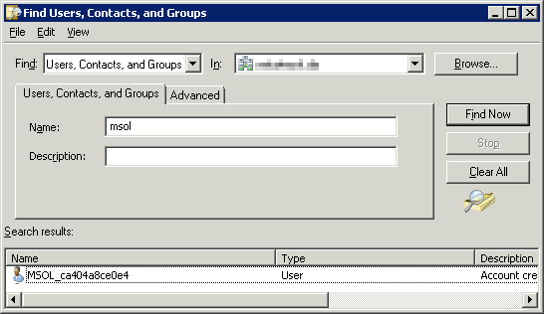
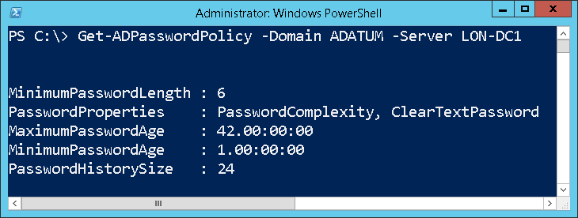
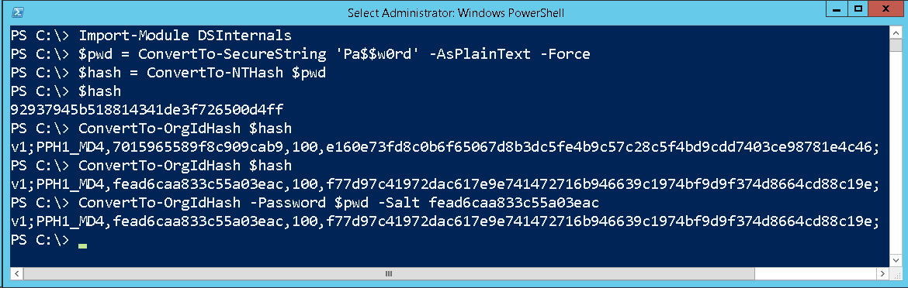

Many people have asked me about the&nbsp;security implications of&nbsp;synchronizing passwords from&nbsp;Active Directory to&nbsp;Azure Active Directory using the&nbsp;[Azure AD Connect](https://www.microsoft.com/en-us/download/details.aspx?id=47594) tool. Although&nbsp;there is&nbsp;an&nbsp;article on Technet that&nbsp;[claims](https://learn.microsoft.com/en-us/azure/active-directory/hybrid/whatis-phs) that&nbsp;the&nbsp;passwords are&nbsp;synced in&nbsp;a&nbsp;very secure hashed form&nbsp;that&nbsp;cannot be&nbsp;misused for&nbsp;authentication against the&nbsp;on-premise Active Directory, it&nbsp;lacks any detail about the&nbsp;exact information being sent to&nbsp;Microsoft’s servers.

A [post](https://techcommunity.microsoft.com/t5/microsoft-entra-azure-ad-blog/aad-password-sync-encryption-and-fips-compliance/ba-p/243709) at the&nbsp;Active Directory Team Blog hints that&nbsp;the&nbsp;Password Sync agent retrieves pre-existing password hashes from&nbsp;AD and&nbsp;secures them by&nbsp;re-hashing them using SHA256 hash per [RFC 2898](https://www.ietf.org/rfc/rfc2898.txt) (aka PBKDF2) before&nbsp;uploading them to&nbsp;the&nbsp;cloud. This&nbsp;sheds some&nbsp;light on the&nbsp;functionality, but&nbsp;some&nbsp;important implementation details are&nbsp;still missing, including the&nbsp;number of&nbsp;SHA256 iterations, salt length and&nbsp;the&nbsp;type of&nbsp;hash that&nbsp;is&nbsp;extracted from&nbsp;AD. Some&nbsp;[research](https://www.cogmotive.com/blog/office-365-tips/how-secure-is-dirsync-with-password-synchronisation) on this&nbsp;topic has been done by&nbsp;Alan Byrne, but&nbsp;it&nbsp;is&nbsp;inconclusive. Therefore, I&nbsp;have decided to&nbsp;do&nbsp;my own research and&nbsp;to&nbsp;share my results.

<!--more-->

## How Azure AD Connect retrieves passwords from&nbsp;AD

AD password synchronization is&nbsp;often implemented using [password filters](https://learn.microsoft.com/en-us/windows/win32/secmgmt/password-filters), but&nbsp;this&nbsp;is&nbsp;not the&nbsp;case. Instead, the&nbsp;[MS-DRSR](https://learn.microsoft.com/en-us/openspecs/windows_protocols/ms-drsr/f977faaa-673e-4f66-b9bf-48c640241d47 "MS-DRSR") protocol is&nbsp;used to&nbsp;remotely retrieve password hashes from&nbsp;DCs. In&nbsp;other words, it&nbsp;basically does the&nbsp;same as&nbsp;the&nbsp;[Get-ADReplAccount](/en/retrieving-active-directory-passwords-remotely/) cmdlet I&nbsp;have recently created. The&nbsp;only sensitive information that&nbsp;the&nbsp;AD Connect pulls from&nbsp;AD is&nbsp;the&nbsp;[unicodePwd](https://learn.microsoft.com/en-us/openspecs/windows_protocols/ms-ada3/71e64720-be27-463f-9cc5-117f4bc849e1) attribute, which&nbsp;contains MD4 hash (aka NT hash) of&nbsp;the&nbsp;password.

You should also know that&nbsp;the&nbsp;password synchronization service connects to&nbsp;AD using a&nbsp;[special account](https://azure.microsoft.com/en-us/documentation/articles/active-directory-aadconnect-accounts-permissions/#custom-settings-installation) whose default name starts with&nbsp;**MSOL\_**. This&nbsp;account is&nbsp;automatically created during the&nbsp;installation process and&nbsp;is&nbsp;delegated the&nbsp;**Replicating Directory Changes All** right. It&nbsp;would be&nbsp;a&nbsp;bad idea to&nbsp;replicate its password to&nbsp;a&nbsp;RODC. Furthermore, its cleartext password is&nbsp;also stored in&nbsp;the&nbsp;SQL Server database that&nbsp;the&nbsp;sync agent uses. It&nbsp;is&nbsp;therefore crucial to&nbsp;ensure that&nbsp;only Domain Admins have access to&nbsp;this&nbsp;DB.

## How Azure AD Connect sends passwords to&nbsp;the&nbsp;Cloud

As already mentioned, a&nbsp;few cryptographic transformations are&nbsp;applied to&nbsp;the&nbsp;MD4 hash by&nbsp;the&nbsp;sync server before&nbsp;it&nbsp;is&nbsp;sent to&nbsp;the&nbsp;cloud:

1. The&nbsp;binary form of&nbsp;the&nbsp;MD4 hash, which&nbsp;has 16B, is&nbsp;converted to&nbsp;a&nbsp;32B uppercase hexadecimal string.
2. This&nbsp;string is&nbsp;then converted back to&nbsp;binary form using the&nbsp;UTF-16 encoding, which&nbsp;extends the&nbsp;result into 64B.
3. Ten random bytes are&nbsp;generated to&nbsp;be&nbsp;used as&nbsp;salt.
4. The&nbsp;data generated in&nbsp;steps 2 and&nbsp;3 is&nbsp;then used as&nbsp;input to&nbsp;the&nbsp;[PBKDF2](https://en.wikipedia.org/wiki/PBKDF2 "PBKDF2") (Password-based Key Derivation Function 2) function with&nbsp;<del>100</del> 1000 (new since&nbsp;2016) iterations of&nbsp;**HMAC-SHA256**. The&nbsp;output is&nbsp;32B long.

This cryptographic transformation is&nbsp;internally called OrgId hash. A&nbsp;more formal definition could look as&nbsp;follows:

**OrgId Hash(NTHash) := PBKDF2( UTF-16( ToUpper( ToHex(NTHash)))), RND(10), 1000, HMAC-SHA256, 32)**

When a&nbsp;password is&nbsp;changed in&nbsp;Active Directory, the&nbsp;DC calculates its NT hash (among a&nbsp;few other kinds of&nbsp;hashes) and&nbsp;stores it&nbsp;in&nbsp;the&nbsp;database:

**NT Hash(plaintext) := MD4(UTF-16(plaintext))**

After combining the&nbsp;2 former definitions, we get this&nbsp;complete transformation of&nbsp;the&nbsp;plaintext password, that&nbsp;is&nbsp;sent to&nbsp;Azure AD:

**OrgId Hash(plaintext) := PBKDF2( UTF-16( ToUpper( ToHex( MD4( UTF-16(plaintext))))), RND(10), 1000, HMAC-SHA256, 32)**

**Example:** MD4 hash of&nbsp;**Pa$$w0rd** is&nbsp;**92937945B518814341DE3F726500D4FF**. Let **317ee9d1dec6508fa510** be&nbsp;the&nbsp;randomly generated salt. The&nbsp;resulting OrgId hash would then be&nbsp; 
**f4a257ffec53809081a605ce8ddedfbc9df9777b80256763bc0a6dd895ef404f**. The&nbsp;hash is&nbsp;then concatenated with&nbsp;the&nbsp;salt and&nbsp;number of&nbsp;iterations into this&nbsp;final string that&nbsp;is&nbsp;sent to&nbsp;Azure AD in&nbsp;this&nbsp;exact form:

**v1;PPH1\_MD4,181a3024085fcee2f70e,1000,b39525c3bc72a1136fcf7c8a338e0c14313d0450d1a4c98ef0a6ddada3bc5b0a;**

Note that&nbsp;the&nbsp;string contains the&nbsp;iteration count and&nbsp;version number equal to&nbsp;1. This&nbsp;means that&nbsp;the&nbsp;protocol has been designed with&nbsp;a&nbsp;potential change in&nbsp;mind.

## Security analysis

Here are&nbsp;my thoughts on the&nbsp;security of&nbsp;the&nbsp;OrgId hash:

### + Proven algorithm

I really praise Microsoft for&nbsp;using the&nbsp;standardized and&nbsp;proven PBKDF2 function instead of&nbsp;reinventing the&nbsp;wheel.

### + Unusable for&nbsp;PTH attacks

The hash that&nbsp;gets sent to&nbsp;the&nbsp;cloud cannot be&nbsp;used in&nbsp;any pass-the-hash attack on Active Directory. The&nbsp;original NT hash cannot be&nbsp;calculated from&nbsp;OrgId hash in&nbsp;reasonable time.

### + Resistant against rainbow table attacks

Thanks to&nbsp;using a&nbsp;random salt, PBKDF2 is&nbsp;immune to&nbsp;rainbow table attacks. The&nbsp;salt is&nbsp;10B long, which&nbsp;is&nbsp;more than&nbsp;the&nbsp;recommended 8B minimum.

### + <del>Very few</del> Enough iterations

While the&nbsp;[RFC document](https://www.ietf.org/rfc/rfc2898.txt "PKCS #5: Password-Based Cryptography Specification") from&nbsp;year 2000 contains a&nbsp;recommendation to&nbsp;use PBKDF2 with&nbsp;at least 1000 iterations, only 100 iterations of&nbsp;HMAC-SHA256 were performed by&nbsp;the&nbsp;sync agent back in&nbsp;2015. Luckily, this&nbsp;has been changed sometime in&nbsp;2016.

### – Unconventional expansion

The method of&nbsp;expanding the&nbsp;16B NT hash into 64B by&nbsp;converting it&nbsp;to&nbsp;hexadecimal string and&nbsp;re-encoding it&nbsp;using UTF-16 is&nbsp;rather unorthodox. It&nbsp;took me some&nbsp;time to&nbsp;figure this&nbsp;out. Fortunately, it&nbsp;probably does not have any impact on security.

## Update 2015-10-19

Just hours after&nbsp;I&nbsp;released information about OrgId hashes, support for&nbsp;this&nbsp;algorithm [has been added](https://hashcat.net/trac/ticket/669) to&nbsp;[oclHashcat](https://hashcat.net/oclhashcat/), which&nbsp;is&nbsp;a&nbsp;popular password cracking tool that&nbsp;utilizes GPUs.

## Update 2016-11-08

Recent versions of&nbsp;Azure AD Connect started using 1000 iterations instead of&nbsp;just 100, as&nbsp;recommended by&nbsp;the&nbsp;[RFC document](https://www.ietf.org/rfc/rfc2898.txt "PKCS #5: Password-Based Cryptography Specification"). This&nbsp;is&nbsp;great news, because&nbsp;this&nbsp;change renders brute-force attacks and&nbsp;even&nbsp;mask or&nbsp;dictionary attacks against OrgId hashes unfeasible.

I just wonder if&nbsp;my blog post influenced this&nbsp;decision. 😉

## Update 2018-?

The official documentation from&nbsp;Microsoft now&nbsp;[properly describes](https://learn.microsoft.com/en-us/azure/active-directory/hybrid/how-to-connect-password-hash-synchronization) the&nbsp;technical details of&nbsp;password hash synchronization.

## Conclusion

I would say that&nbsp;the&nbsp;Password Sync feature is&nbsp;**very** **secure <del>enough</del>**<del>, despite the&nbsp;relatively low iteration count</del>. Even&nbsp;if&nbsp;someone hacked Microsoft and&nbsp;leaked these hashes, only weak passwords like “November2016” would be&nbsp;crackable using specialized software. But&nbsp;if&nbsp;you really want to&nbsp;play it&nbsp;safe, you should follow these recommendations:

1. Implement a&nbsp;reasonable **password policy** to&nbsp;prevent dictionary attacks being successful.
  
2. Secure remote access to&nbsp;your network by&nbsp;using **multi-factor authentication**, so&nbsp;that&nbsp;the&nbsp;knowledge of&nbsp;someone’s password is&nbsp;not enough to&nbsp;get access to&nbsp;corporate resources.
3. Never, ever, under no circumstances, sync passwords of&nbsp;**administrative accounts** (Domain Admins, Schema Admins, etc.) to&nbsp;ANY cloud service.

And for&nbsp;those who&nbsp;are&nbsp;still in&nbsp;doubt, Microsoft offers an&nbsp;alternative, the&nbsp;so-called [Federated Identity](https://support.office.com/en-us/article/Understanding-Office-365-identity-and-Azure-Active-Directory-06a189e7-5ec6-4af2-94bf-a22ea225a7a9#BK_Federated). The&nbsp;difference is&nbsp;that&nbsp;passwords are&nbsp;verified by&nbsp;the&nbsp;on-premises Active Directory, which&nbsp;means that&nbsp;the&nbsp;password hashes do&nbsp;not need to&nbsp;be&nbsp;synchronized to&nbsp;Azure AD.

## Sample implementation

For demonstration purposes, I&nbsp;have created my own implementation of&nbsp;the&nbsp;OrgId hash function that&nbsp;returns the&nbsp;same results as&nbsp;the&nbsp;original one. It&nbsp;can&nbsp;be&nbsp;played with&nbsp;using the&nbsp;**ConvertTo-OrgIdHash** cmdlet from&nbsp;the&nbsp;[DSInternals](/en/projects/) PowerShell module. Here is&nbsp;an&nbsp;example of&nbsp;its usage:

