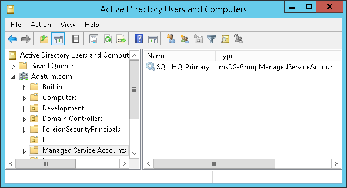

Have you ever wondered how the&nbsp;automatically generated passwords of&nbsp;Group Managed Service Accounts (GMSA) look like? Well, you can fetch them from&nbsp;Active Directory in&nbsp;the&nbsp;same way as&nbsp;Windows Servers do&nbsp;and&nbsp;see yourself. Here is&nbsp;how:

## Creating a&nbsp;GMSA

To start experimenting, we need to&nbsp;have a&nbsp;GMSA first, so&nbsp;we create one:

```powershell
# Create a new KDS Root Key that will be used by DC to generate managed passwords
Add-KdsRootKey -EffectiveTime (Get-Date).AddHours(-10)

# Create a new GMSA
New-ADServiceAccount `
	-Name 'SQL_HQ_Primary' `
	-DNSHostName 'sql1.adatum.com'

```

<!--more-->

We can check the&nbsp;result in&nbsp;the&nbsp;*Active Directory Users and&nbsp;Computers* console:



Unfortunately, the&nbsp;built-in GUI will not help us much when&nbsp;working with&nbsp;GMSAs. Although&nbsp;there is&nbsp;a&nbsp;[nice 3rd party tool](https://www.cjwdev.com/Software/MSAGUI/Info.html), we will stick to&nbsp;PowerShell.

## Setting the&nbsp;Managed Password ACL

Now&nbsp;we need to provide a list of&nbsp;principals that&nbsp;are&nbsp;allowed to&nbsp;retrieve the&nbsp;plaintext password from&nbsp;DCs through LDAP. Normally, we would grant this&nbsp;privilege to one or&nbsp;more servers (members of&nbsp;the&nbsp;same cluster/web farm). But&nbsp;we will grant the&nbsp;privilege to&nbsp;ourselves instead:

```powershell
Set-ADServiceAccount `
	-Identity 'SQL_HQ_Primary' `
	-PrincipalsAllowedToRetrieveManagedPassword 'Administrator'
```

Of course, you should not use the&nbsp;built-in Administrator account in&nbsp;a&nbsp;production environment.

## Retrieving the&nbsp;Managed Password

Now comes the&nbsp;fun part:

```powershell
# We have to explicitly ask for the value of the msDS-ManagedPassword attribute. Even a wildcard (*) would not work.
Get-ADServiceAccount `
	-Identity 'SQL_HQ_Primary' `
	-Properties 'msDS-ManagedPassword'

<#
Output:

DistinguishedName : CN=SQL_HQ_Primary,CN=Managed Service Accounts,DC=Adatum,DC=com
Enabled : True
msDS-ManagedPassword : {1, 0, 0, 0...}
Name : SQL_HQ_Primary
ObjectClass : msDS-GroupManagedServiceAccount
ObjectGUID : 5f8e24c5-bd21-43a4-95ab-c67939434e81
SamAccountName : SQL_HQ_Primary$
SID : S-1-5-21-3180365339-800773672-3767752645-4102
UserPrincipalName :

#>
```

Note that&nbsp;until&nbsp;now, we have only used regular, built-in cmdlets from&nbsp;the&nbsp;ActiveDirectory module, courtesy of&nbsp;Microsoft.

## Decoding the&nbsp;Managed Password

Let's have a&nbsp;look at the&nbsp;msDS-ManagedPassword attribute, that&nbsp;has been returned by&nbsp;the&nbsp;command above. It&nbsp;is&nbsp;a constructed attribute, which&nbsp;means that&nbsp;its value is&nbsp;calculated by&nbsp;DC from&nbsp;the&nbsp;KDS root key and&nbsp;the&nbsp;msDS-ManagedPasswordId attribute every time someone asks for&nbsp;it. Although&nbsp;documented, the&nbsp;cryptographic algorithm used is&nbsp;quite complicated. Furthermore, the&nbsp;value of&nbsp;the&nbsp;msDS-ManagedPasswordId gets re-generated every (msDS-ManagedPasswordInterval)-days (30 by&nbsp;default).

We see that&nbsp;the&nbsp;msDS-ManagedPassword attribute of&nbsp;our GMSA contains a&nbsp;sequence of&nbsp;bytes. It&nbsp;is&nbsp;a&nbsp;binary representation of&nbsp;the&nbsp;[MSDS-MANAGEDPASSWORD_BLOB](https://learn.microsoft.com/en-us/openspecs/windows_protocols/ms-adts/a9019740-3d73-46ef-a9ae-3ea8eb86ac2e) data structure, which&nbsp;contains some&nbsp;metadata in&nbsp;addition to&nbsp;the&nbsp;actual password. As&nbsp;there had been no publicly available tool to&nbsp;decode this&nbsp;structure, I&nbsp;have created one myself:

```powershell
# Save the blob to a variable
$gmsa = Get-ADServiceAccount `
	-Identity 'SQL_HQ_Primary' `
	-Properties 'msDS-ManagedPassword'
$mp = $gmsa.'msDS-ManagedPassword'

# Decode the data structure using the DSInternals module
ConvertFrom-ADManagedPasswordBlob $mp

<#
Output:

Version : 1
CurrentPassword : 湤ୟɰ橣낔饔ᦺ几᧾ʞꈠ⿕ՔὬ랭뷾햾咶郸�렇ͧ퀟᝘럓몚ꬶ佩䎖∘Ǐ㦗ן뱷鼹⽩Ⲃ⫝咽㠅Ｅ䠹鸞왶婰鞪
PreviousPassword :
QueryPasswordInterval : 29.17:15:36.3736817
UnchangedPasswordInterval : 29.17:10:36.3736817

#>
```

TADA!!! The&nbsp;CurrentPassword property contains the&nbsp;actual cleartext password of&nbsp;the&nbsp;GMSA in&nbsp;question. Why&nbsp;does it&nbsp;look like gibberish? Because&nbsp;it&nbsp;is&nbsp;just 256 bytes of&nbsp;pseudorandom data, interpreted as&nbsp;128 UTF-16 characters. Good luck writing that&nbsp;on your keyboard. But&nbsp;if&nbsp;we [calculate its NT hash](/en/dsinternals-powershell-module-released/), it&nbsp;will match the&nbsp;[hash stored in&nbsp;AD](/en/dumping-ntds-dit-files-using-powershell/).

## Conclusion

We have seen that&nbsp;retrieving the&nbsp;value of&nbsp;GMSA passwords is&nbsp;quite easy. But&nbsp;don’t be&nbsp;afraid, there is&nbsp;no security hole in&nbsp;Active Directory. The&nbsp;cleartext password is&nbsp;always passed through an&nbsp;encrypted channel, it&nbsp;is&nbsp;automatically changed on a&nbsp;regular basis and&nbsp;even&nbsp;members of&nbsp;the&nbsp;Domain Admins group are&nbsp;not allowed to&nbsp;retrieve it&nbsp;by&nbsp;default. So&nbsp;do&nbsp;not hesitate and&nbsp;start using the&nbsp;(Group) Managed Service Accounts. They are&nbsp;much safer than&nbsp;using regular accounts for&nbsp;running services.

If you want to&nbsp;play more with&nbsp;this&nbsp;stuff, just [grab the&nbsp;DSInternals module](/en/projects/). And&nbsp;for&nbsp;developers, the&nbsp;C# code I&nbsp;use to&nbsp;decode the&nbsp;structure can be&nbsp;found on [GitHub](https://github.com/MichaelGrafnetter/DSInternals/blob/master/Src/DSInternals.Common/Data/Principals/ManagedPassword.cs).
