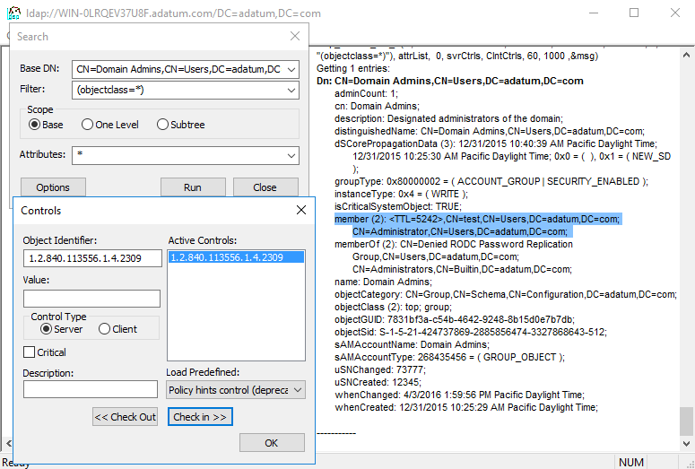

One of&nbsp;the&nbsp;new features in&nbsp;Windows Server 2016 will be&nbsp;the&nbsp;Active Directory Expiring Links feature, which&nbsp;enables time-bound group membership, expressed by&nbsp;a&nbsp;time-to-live (TTL) value. Here is&nbsp;how it&nbsp;works:

<!--more-->

## Enabling the&nbsp;Expiring Links Feature

The Expiring Links feature had been a&nbsp;standalone feature in&nbsp;early Windows Server 2016 builds, but&nbsp;as&nbsp;of&nbsp;TP4, it&nbsp;is&nbsp;a&nbsp;part of&nbsp;the&nbsp;broader [Privileged Access Management (PAM)](https://learn.microsoft.com/en-us/microsoft-identity-manager/pam/privileged-identity-management-for-active-directory-domain-services) feature. It&nbsp;is&nbsp;disabled by&nbsp;default, because&nbsp;it&nbsp;requires **Windows Server 2016 forest functional level**. One of&nbsp;the&nbsp;ways to&nbsp;enable the&nbsp;PAM feature is&nbsp;running this&nbsp;PowerShell cmdlet:

```powershell
Enable-ADOptionalFeature -Identity 'Privileged Access Management Feature' -Target (Get-ADForest) -Scope ForestOrConfigurationSet
```

Note that&nbsp;once&nbsp;this&nbsp;feature is&nbsp;enabled in&nbsp;a&nbsp;forest, it&nbsp;can&nbsp;never be&nbsp;disabled again.

## Creating Expiring Links using PowerShell

Unfortunately, this&nbsp;feature is&nbsp;not exposed in&nbsp;any GUI (yet), so&nbsp;you cannot create expiring links, nor&nbsp;can&nbsp;you tell the&nbsp;difference between a&nbsp;regular link and&nbsp;an&nbsp;expiring one. We will therefore use PowerShell to&nbsp;do&nbsp;the&nbsp;job:

```powershell
# Add user PatColeman to the Domain Admins group for the next 2 hours
$ttl = New-TimeSpan -Hours 2
Add-ADGroupMember -Identity 'Domain Admins' -Members PatColeman -MemberTimeToLive $ttl

# Show group membership with TTL
Get-ADGroup -Identity 'Domain Admins' -ShowMemberTimeToLive -Properties member | Select-Object -ExpandProperty member
<#
Output:
<TTL=6987>,CN=PatColeman,CN=Users,DC=adatum,DC=com
CN=Administrator,CN=Users,DC=adatum,DC=com
#>
```

As we can&nbsp;see, the&nbsp;TTL value in&nbsp;the&nbsp;output is&nbsp;in&nbsp;seconds (2h = 7200s). As&nbsp;soon as&nbsp;the&nbsp;TTL expires, the&nbsp;DCs will automatically remove user PatColeman from&nbsp;the&nbsp;Domain Admins group and&nbsp;his&nbsp;current **Kerberos tickets will also expire**.

## Creating Expiring Links using LDAP

PowerShell is&nbsp;great, but&nbsp;what if&nbsp;we needed to&nbsp;stick with&nbsp;pure LDAP? Well, if&nbsp;you want to&nbsp;add a&nbsp;user into a&nbsp;group for&nbsp;a&nbsp;limited amount of&nbsp;time, you do&nbsp;it&nbsp;exactly as&nbsp;you are&nbsp;used to, but&nbsp;you have to&nbsp;specify his&nbsp;distinguished name (DN) in&nbsp;the&nbsp;new [TTL-DN form](https://learn.microsoft.com/en-us/openspecs/windows_protocols/ms-adts/b645c125-a7da-4097-84a1-2fa7cea07714#gt_2188fc83-e53b-4464-867d-9ab1c62e1619): &lt;TTL=TimeToLive,DN&gt;. In&nbsp;our sample case, it&nbsp;would look like this:

**&lt;TTL=7200,CN=PatColeman,CN=Users,DC=adatum,DC=com&gt;**

To view the&nbsp;group membership with&nbsp;TTLs, the&nbsp;corresponding LDAP search operation has to&nbsp;contain the&nbsp;[LDAP\_SERVER\_LINK\_TTL](https://learn.microsoft.com/en-us/openspecs/windows_protocols/ms-adts/f4f523a8-abc0-4b3a-a471-6b2fef135481) extended control (OID = 1.2.840.113556.1.4.2309). Here is&nbsp;a&nbsp;screenshot from&nbsp;the&nbsp;**ldp.exe** tool with&nbsp;this&nbsp;control enabled:



## Implementation Details (Very Advanced Stuff)

I was also quite interested in&nbsp;how this&nbsp;feature is&nbsp;implemented in&nbsp;the&nbsp;**ntds.dit** file. I&nbsp;have found out that&nbsp;as&nbsp;soon as&nbsp;you enable the&nbsp;PAM feature, the&nbsp;DCs automatically extend their database schemas in&nbsp;the&nbsp;following way:

1. The&nbsp;**expiration\_time\_col** column is&nbsp;added to&nbsp;the&nbsp;**link\_table** table. It&nbsp;contains timestamps (in the&nbsp;UTC [FILETIME](https://learn.microsoft.com/en-us/windows/win32/api/minwinbase/ns-minwinbase-filetime) / 10<sup>7</sup> format), after&nbsp;which&nbsp;the&nbsp;links get deactivated. This&nbsp;is&nbsp;yet&nbsp;another reason for&nbsp;the&nbsp;time to&nbsp;be&nbsp;in&nbsp;sync between DCs.
2. The&nbsp;**link\_expiration\_time\_index** index is&nbsp;added to&nbsp;the&nbsp;**link\_table** table. It&nbsp;is&nbsp;created over these columns: **expiration\_time\_col**, **link\_DNT**, **backlink\_DNT**. Thanks to&nbsp;this&nbsp;index, DCs can&nbsp;find expired links very quickly.
