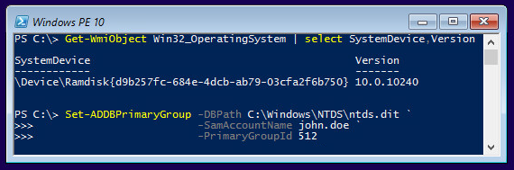

---
ref: 7611
title: 'Dumping and&nbsp;Modifying Active Directory Database Using a&nbsp;Bootable Flash Drive'
date: 2016-07-19T15:18:36+00:00
layout: post
lang: en
image: /assets/images/winpe.png
permalink: /en/dumping-modifying-active-directory-database-bootable-flash-drive/
tags:
    - 'Active Directory'
    - DPAPI
    - PowerShell
    - Security
---

Since version 2.15, the&nbsp;[DSInternals PowerShell Module](https://github.com/MichaelGrafnetter/DSInternals) fully supports [Windows PE](https://learn.microsoft.com/en-us/windows-hardware/manufacture/desktop/winpe-intro?view=windows-11), the&nbsp;free minimalistic edition of&nbsp;Windows. This&nbsp;means that&nbsp;all the&nbsp;nasty Active Directory database stuff can now&nbsp;be&nbsp;performed from&nbsp;a&nbsp;bootable flash drive or&nbsp;an&nbsp;ISO image, including:

- [Dumping NT hashes, kerberos keys and&nbsp;cleartext passwords](/en/dumping-ntds-dit-files-using-powershell/) from&nbsp;ntds.dit files.
- Modifying the&nbsp;SID History of&nbsp;user accounts and&nbsp;groups.
- Modifying the&nbsp;Primary Group ID of&nbsp;user accounts.
- [Extracting the&nbsp;DPAPI domain backup keys](/en/retrieving-dpapi-backup-keys-from-active-directory/).



<!--more-->

> DISCLAIMER: Features exposed through the&nbsp;DSInternals module are not supported by&nbsp;Microsoft and&nbsp;it&nbsp;is&nbsp;therefore not intended to&nbsp;be&nbsp;used in&nbsp;production environments. Improper use might cause irreversible damage to&nbsp;domain controllers or&nbsp;negatively impact domain security.

## Required access

These actions would of&nbsp;course require an&nbsp;attacker to&nbsp;have one of&nbsp;the&nbsp;following:

- Physical access to&nbsp;a&nbsp;domain controller (DC).
- Knowledge of&nbsp;DC’s baseboard management controller (BMC) credentials.
- Administrative access to&nbsp;a&nbsp;virtualized DC.

In an&nbsp;ideal world, only Domain Admins should have such non-trivial access to&nbsp;the&nbsp;core AD infrastructure, but&nbsp;the&nbsp;everyday reality is&nbsp;far from&nbsp;perfect.

## Creating the&nbsp;media

To create a&nbsp;bootable Windows PE media loaded with&nbsp;the&nbsp;DSInternals module, follow these steps:

1. Install the&nbsp;[Windows Assessment and&nbsp;Deployment Kit (ADK)](https://go.microsoft.com/fwlink/p/?LinkId=526803), including the&nbsp;Windows PE feature.
2. Click *Start*, and&nbsp;type *deployment*. Right-click *Deployment and&nbsp;Imaging Tools Environment* and&nbsp;then select *Run as&nbsp;administrator*.
3. Create a&nbsp;working copy of&nbsp;the&nbsp;Windows PE files. Specify either x86 or&nbsp;amd64:
```bat
copype amd64 C:\WinPE_amd64
```
4. Mount the&nbsp;Windows PE image:
```bat
Dism /Mount-Image /ImageFile:"C:\WinPE_amd64\media\sources\boot.wim" /index:1 /MountDir:"C:\WinPE_amd64\mount"
```
5. Add PowerShell support to&nbsp;Windows PE by&nbsp;adding a&nbsp;few [optional components](https://learn.microsoft.com/en-us/windows-hardware/manufacture/desktop/winpe-add-packages--optional-components-reference?view=windows-11), together with&nbsp;their associated language packs:

    ```bat
    Dism /Add-Package /Image:"C:\WinPE_amd64\mount" /PackagePath:"C:\Program Files\Windows Kits\10\Assessment and Deployment Kit\Windows Preinstallation Environment\amd64\WinPE_OCs\WinPE-WMI.cab"
    Dism /Add-Package /Image:"C:\WinPE_amd64\mount" /PackagePath:"C:\Program Files\Windows Kits\10\Assessment and Deployment Kit\Windows Preinstallation Environment\amd64\WinPE_OCs\en-us\WinPE-WMI_en-us.cab"
        
    Dism /Add-Package /Image:"C:\WinPE_amd64\mount" /PackagePath:"C:\Program Files\Windows Kits\10\Assessment and Deployment Kit\Windows Preinstallation Environment\amd64\WinPE_OCs\WinPE-NetFX.cab"
    Dism /Add-Package /Image:"C:\WinPE_amd64\mount" /PackagePath:"C:\Program Files\Windows Kits\10\Assessment and Deployment Kit\Windows Preinstallation Environment\amd64\WinPE_OCs\en-us\WinPE-NetFX_en-us.cab"
        
    Dism /Add-Package /Image:"C:\WinPE_amd64\mount" /PackagePath:"C:\Program Files\Windows Kits\10\Assessment and Deployment Kit\Windows Preinstallation Environment\amd64\WinPE_OCs\WinPE-Scripting.cab"
    Dism /Add-Package /Image:"C:\WinPE_amd64\mount" /PackagePath:"C:\Program Files\Windows Kits\10\Assessment and Deployment Kit\Windows Preinstallation Environment\amd64\WinPE_OCs\en-us\WinPE-Scripting_en-us.cab"
        
    Dism /Add-Package /Image:"C:\WinPE_amd64\mount" /PackagePath:"C:\Program Files\Windows Kits\10\Assessment and Deployment Kit\Windows Preinstallation Environment\amd64\WinPE_OCs\WinPE-PowerShell.cab"
    Dism /Add-Package /Image:"C:\WinPE_amd64\mount" /PackagePath:"C:\Program Files\Windows Kits\10\Assessment and Deployment Kit\Windows Preinstallation Environment\amd64\WinPE_OCs\en-us\WinPE-PowerShell_en-us.cab"
    ```

6. Add the&nbsp;[DSInternals PowerShell module](https://github.com/MichaelGrafnetter/DSInternals/releases) to&nbsp;the&nbsp;Windows PE image by&nbsp;copying it&nbsp;into the&nbsp;*C:\\WinPE\_amd64\\mount\\Windows\\system32\\ WindowsPowerShell\\v1.0\\Modules* folder.

7. [Add device drivers](https://learn.microsoft.com/en-us/windows-hardware/manufacture/desktop/add-and-remove-drivers-to-an-offline-windows-image?view=windows-11) to&nbsp;the&nbsp;Windows PE image:

    ```bat
    Dism /Add-Driver /Image:"C:\WinPE_amd64\mount" /Driver:"C:\DriversToEmbed" /Recurse
    ```

8. Configure PowerShell to&nbsp;start automatically after&nbsp;boot by&nbsp;creating a&nbsp;file called *winpeshl.ini* in&nbsp;the&nbsp;*C:\\WinPE\_amd64\\mount\\Windows\\system32* folder, containing this&nbsp;text:

    ```ini
    [LaunchApps]
    wpeinit.exe
    powershell.exe, -NoExit -NoLogo -ExecutionPolicy Bypass
    ```

9. [Create an&nbsp;ISO file](https://learn.microsoft.com/en-us/windows-hardware/manufacture/desktop/makewinpemedia-command-line-options?view=windows-11) containing the&nbsp;Windows PE files:

    ```bat
    MakeWinPEMedia /ISO C:\WinPE_amd64 C:\WinPE_amd64\WinPE_amd64.iso
    ```
    
    The&nbsp;same command can be&nbsp;used to&nbsp;create a&nbsp;bootable flash drive or&nbsp;VHD.

## Final thoughts

As&nbsp;you have seen, it&nbsp;is&nbsp;pretty straightforward to&nbsp;create a&nbsp;bootable flash drive that&nbsp;can be&nbsp;used to&nbsp;conquer an&nbsp;Active Directory domain through a&nbsp;physically accessible DC. One of&nbsp;the&nbsp;precautions a&nbsp;domain administrator can take is&nbsp;to&nbsp;encrypt all DCs using BitLocker or&nbsp;other tool that&nbsp;does full volume encryption. Deploying RODCs at smaller branch offices is&nbsp;also a&nbsp;good idea. The&nbsp;new features in&nbsp;Windows Server 2016, Virtual TPMs and&nbsp;Shielded VMs, also seem very promising in&nbsp;regards to&nbsp;DC security.
