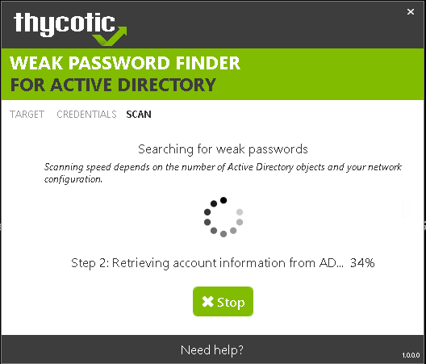
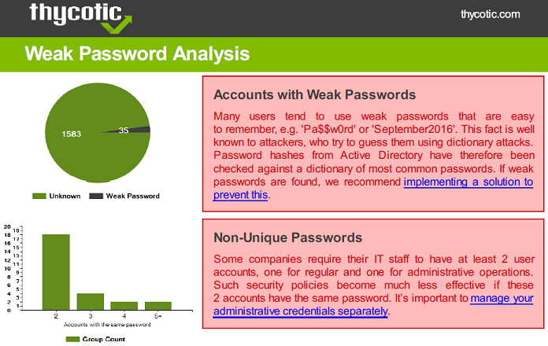
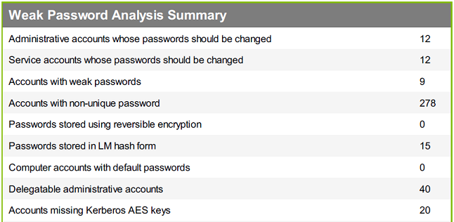

I recently worked with [Thycotic](https://thycotic.com/) to create a program called [Weak Password Finder for Active Directory](https://thycotic.com/solutions/free-it-tools/weak-password-finder/weak-password-finder-nvlss/). The goal was to develop a tool that would be very easy to use yet powerful enough to yield actionable results. I think that this combination really makes it unique in the market. It basically does the same as my [PowerShell module](/en/auditing-active-directory-password-quality/), but with a nice and shiny user interface:

<!--more-->

It generates reports which are suitable for the management:

Of course, you can also drill down through the detailed data:

Here is a quick demo of the tool:

<iframe allowfullscreen="allowfullscreen" frameborder="0" height="281" mozallowfullscreen="mozallowfullscreen" src="https://player.vimeo.com/video/197521549" title="Weak Password Finder Demo" webkitallowfullscreen="webkitallowfullscreen" width="500"></iframe>

Did I&nbsp;mention that&nbsp;the [Weak Password Finder](https://thycotic.com/solutions/free-it-tools/weak-password-finder/weak-password-finder-nvlss/) is&nbsp;totally free?