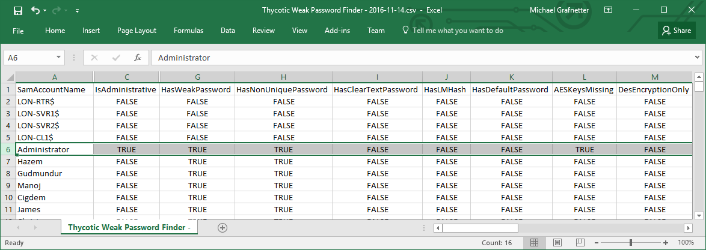

I recently worked with&nbsp;[Thycotic](https://thycotic.com/) to&nbsp;create a&nbsp;program called [Weak Password Finder for&nbsp;Active Directory](https://thycotic.com/solutions/free-it-tools/weak-password-finder/weak-password-finder-nvlss/). The&nbsp;goal was to&nbsp;develop a&nbsp;tool that&nbsp;would be&nbsp;very easy to&nbsp;use yet&nbsp;powerful enough to&nbsp;yield actionable results. I&nbsp;think that&nbsp;this&nbsp;combination really makes it&nbsp;unique in&nbsp;the&nbsp;market. It&nbsp;basically does the&nbsp;same as&nbsp;my [PowerShell module](/en/auditing-active-directory-password-quality/), but&nbsp;with&nbsp;a&nbsp;nice and&nbsp;shiny user interface:

<!--more-->

It generates reports which&nbsp;are&nbsp;suitable for&nbsp;the&nbsp;management:

Of course, you can also drill down through the&nbsp;detailed data:

Here is&nbsp;a&nbsp;quick demo of&nbsp;the&nbsp;tool:



Did I&nbsp;mention that&nbsp;the&nbsp;[Weak Password Finder](https://thycotic.com/solutions/free-it-tools/weak-password-finder/weak-password-finder-nvlss/) is&nbsp;totally free?
