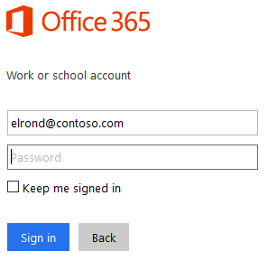
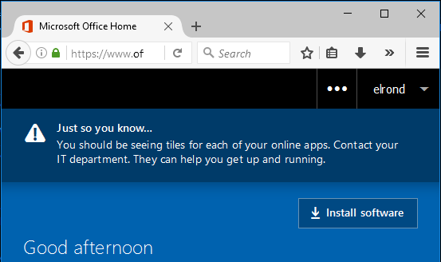

Last month, Microsoft has introduced a&nbsp;new feature of&nbsp;Azure AD Connect called [Single Sign On](https://docs.microsoft.com/en-us/azure/active-directory/connect/active-directory-aadconnect-sso). It allows companies to&nbsp;configure SSO between AD and&nbsp;AAD without the&nbsp;need to&nbsp;deploy [ADFS](https://learn.microsoft.com/en-us/windows-server/identity/active-directory-federation-services), which&nbsp;makes it an ideal solution for&nbsp;SMEs. Here is&nbsp;a high-level diagram of&nbsp;this functionality:

 As we can see from&nbsp;the&nbsp;diagram above, Azure AD exposes a [publicly available endpoint](https://autologon.microsoftazuread-sso.com) that&nbsp;accepts Kerberos tickets and&nbsp;translates them into SAML and&nbsp;JWT tokens, which&nbsp;are understood and&nbsp;trusted by&nbsp;other cloud services like Office 365, Azure or&nbsp;Salesforce. And&nbsp;wherever you have Kerberos-based authentication, it can be attacked using [Silver Tickets](https://adsecurity.org/?p=2011).

In&nbsp;usual circumstances this attack can only be performed from&nbsp;the&nbsp;intranet. But&nbsp;what really caught my attention is&nbsp;the fact that&nbsp;with this new SSO feature, **Silver Tickets could be used from&nbsp;the&nbsp;entire internet**. Let’s give it a&nbsp;try then!

<!--more-->
## The&nbsp;Nasty Stuff

To&nbsp;test this technique, we need to&nbsp;retrieve some information from&nbsp;Active Directory first:

1. NTLM password hash of&nbsp;the [AZUREADSSOACC](https://docs.microsoft.com/en-us/azure/active-directory/connect/active-directory-aadconnect-sso#how-single-sign-on-works) account, e.g. *f9969e088b2c13d93833d0ce436c76dd*. This value can be retrieved from AD using [mimikatz](https://github.com/gentilkiwi/mimikatz):
```bat
mimikatz.exe "lsadump::dcsync /user:AZUREADSSOACC$" exit
```
    
My own [DSInternals PowerShell Module](https://github.com/MichaelGrafnetter/DSInternals) could do&nbsp;the same job:
    
```powershell
Get-ADReplAccount -SamAccountName 'AZUREADSSOACC$' -Domain contoso `
-Server lon-dc1.contoso.local
```
    
Both of these commands need *Domain Admins* permissions.

2. Name of the AD domain, e.g. *contoso.local*.
3. AAD logon name of the user we want to impersonate, e.g. elrond@contoso.com. This is typically either his *userPrincipalName* or *mail* attribute from the on-prem AD.
4. SID of the user we want to impersonate, e.g. *S-1-5-21-2121516926-2695913149-3163778339-1234*.

Having this information we can now create and use the Silver Ticket on any Windows computer connected to the internet. It does not even matter whether it is joined to a domain or a workgroup:

1. Create the Silver Ticket and inject it into Kerberos cache:
```bat
mimikatz.exe "kerberos::golden /user:elrond /sid:S-1-5-21-2121516926-2695913149-3163778339 /id:1234 /domain:contoso.local /rc4:f9969e088b2c13d93833d0ce436c76dd /target:aadg.windows.net.nsatc.net /service:HTTP /ptt" exit
```
2. Launch *Mozilla Firefox*.
3. Go to <about:config> and set the [network.negotiate-auth.trusted-uris](https://developer.mozilla.org/en-US/docs/Mozilla/Integrated_authentication) preference to [value](https://docs.microsoft.com/en-us/azure/active-directory/connect/active-directory-aadconnect-sso#ensuring-clients-sign-in-automatically) “https://aadg.windows.net.nsatc.net,https://autologon.microsoftazuread-sso.com”.
4. Navigate to any web application that is integrated with our AAD domain. We will use [Office 365](https://portal.office.com), which is the most commonly used one.
5. Once at the logon screen, fill in the user name, while leaving the password field empty. Then press TAB or ENTER.  
    
6. That’s it, we’re in!
7. To log in as another user, run the command below and repeat steps 1-6.
```bat
klist purge
```

It is also worth noting that the password of the *AZUREADSSOACC* account never changes, so the stolen hash/key will work forever. It could therefore be misused by highly privileged employees to retain access to the IT environment after leaving the company. Dealing with such situations is a much broader problem, which is aptly depicted by the following old Narnian saying:


## Countermeasures

First of&nbsp;all, I&nbsp;have to&nbsp;point out that&nbsp;this technique would not be very practical in&nbsp;real-world situations due to&nbsp;these reasons:

- The SSO feature is in Preview and has to be explicitly enabled by an AD admin. Just a handful of companies probably use it at the time of writing this article and enterprises will quite surely stick to their proven ADFS deployments even after this feature reaches GA.
- The hash/key of the *AZUREADSSOACC* account can only be retrieved by Domain Admins from DCs by default. But if an attacker had such highly privileged access to an Active Directory domain, he/she would be able to do some way nastier stuff than just replicating a single hash.
- The password of the *AZUREADSSOACC* account is randomly generated during the deployment of *Azure AD Connect*. It would therefore be impossible to guess this password.

As&nbsp;you can see, there is&nbsp;simply no need to&nbsp;panic. But&nbsp;just to&nbsp;be safe, I&nbsp;would recommend these generic security measures:

- Only delegate administrative access to trusted individuals and keep the number of members of the *Domain Admins* group (and other privileged groups) as low as possible.
- Protect backups of Domain Controllers, so no-one could [extract sensitive information](/en/dumping-ntds-dit-files-using-powershell/) from them.
- Enable and enforce [Azure MFA](https://docs.microsoft.com/en-us/azure/multi-factor-authentication/multi-factor-authentication) for users authenticating from external IP addresses. It is very straightforward and effective against many kinds of attacks.
- Consider implementing [Azure AD conditional access](https://docs.microsoft.com/cs-cz/azure/active-directory/active-directory-conditional-access).
- Deploy [Microsoft Defender for Identity](https://www.microsoft.com/en-us/cloud-platform/advanced-threat-analytics) to detect malicious replication and other threats to your AD infrastructure.  
- Force a password change on the *AZUREADSSOACC* account by <del>re-deploying Azure AD Connect SSO</del> [running the Update-AzureSSOForest cmdlet](https://docs.microsoft.com/en-us/azure/active-directory/connect/active-directory-aadconnect-sso-faq#how-can-i-roll-over-the-kerberos-decryption-key-of-the-azureadssoacc-computer-account) after a highly privileged employee leaves the company and/or on a regular basis. This should be done together with resetting the password of *krbtgt* and other sensitive accounts.

## Conclusion

Although&nbsp;the&nbsp;Silver Ticket attack has been here for&nbsp;some years, it is&nbsp;now probably the&nbsp;first time it can be used over the&nbsp;internet against a&nbsp;cloud service, which&nbsp;theoretically makes it even&nbsp;more potent. On the&nbsp;other hand, it would be quite hard to  perform this technique in&nbsp;a real-world environment due to&nbsp;impracticalities discussed in&nbsp;the&nbsp;previous section, so&nbsp;there is&nbsp;no need to&nbsp;worry. The&nbsp;new Seamless SSO feature of&nbsp;Azure AD Connect can therefore be considered safe and&nbsp;preferred solution for&nbsp;SSO to&nbsp;Office 365.