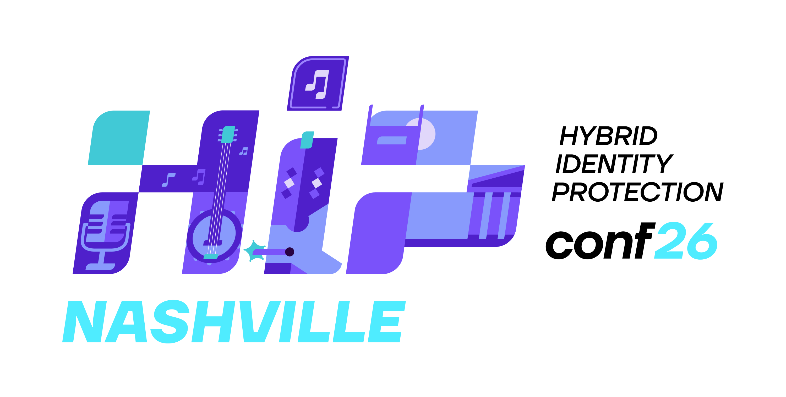

After presenting my novel research on&nbsp;KDS Root Keys to&nbsp;the European audience at&nbsp;TROOPERS26 in&nbsp;Heidelberg, I&nbsp;am&nbsp;thrilled to&nbsp;get the&nbsp;opportunity to&nbsp;share it&nbsp;with the&nbsp;US&nbsp;audience in&nbsp;vibrant Nashville. I&nbsp;will be&nbsp;speaking at&nbsp;the [Hybrid Identity Protection Conference&nbsp;26](https://semperis.swoogo.com/hipconf26/agenda) in&nbsp;Nashville, Tennessee, on&nbsp;**September&nbsp;8&ndash;10, 2026**. My&nbsp;session, *KDS Root Keys and&nbsp;Where to&nbsp;Find Them*, is&nbsp;scheduled for **Wednesday, September&nbsp;9 at&nbsp;11:15&nbsp;AM** in&nbsp;the Identity Security Research track.

KDS Root Keys are the&nbsp;cryptographic seeds that Active Directory uses to&nbsp;derive gMSA and&nbsp;dMSA passwords, encrypt Windows&nbsp;LAPS secrets, and&nbsp;power DPAPI-NG SID protectors. Stealing them unlocks far more than just a&nbsp;single account. The session will cover online and&nbsp;offline attacks against virtually every use case of&nbsp;KDS Root Keys, including:

- Decryption of&nbsp;volumes with BitLocker SID Protector enabled.
- Exporting RSA private keys from&nbsp;group-protected PFX files.
- Extracting DNSSEC signing keys (ZSK and&nbsp;KSK) from&nbsp;Active Directory.
- Recovering ASP.NET Core database connection strings.
- Bulk export of&nbsp;Windows LAPS and&nbsp;DSRM passwords.
- Generation of&nbsp;gMSA and&nbsp;dMSA passwords offline.

I&nbsp;will also reveal a&nbsp;newly discovered universal attack against DPAPI-NG SID protectors, allowing any application-encrypted secret to&nbsp;be unlocked without application-specific decryptors.

See you in&nbsp;Nashville!
