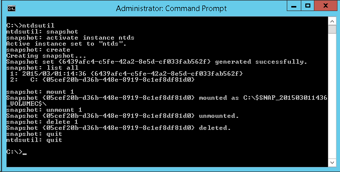
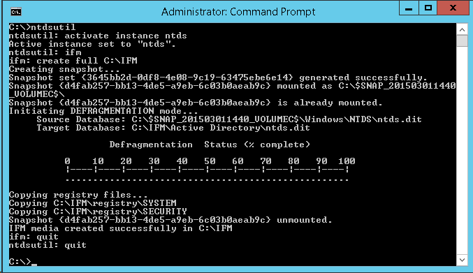
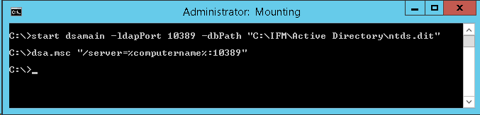

Ako jeden z&nbsp;mechanizmov zálohovania Active Directory sa&nbsp;mi&nbsp;osvedčili každodenné snapshoty databázy. Nedajú sa&nbsp;síce použiť priamo k&nbsp;obnoveniu DC, ale&nbsp;v&nbsp;kombinácii s&nbsp;nástrojom [dsamain](https://learn.microsoft.com/en-us/previous-versions/windows/it-pro/windows-server-2012-R2-and-2012/cc772168(v=ws.11) "Dsamain") umožňujú veľmi rýchlo nahliadnuť do&nbsp;historického stavu domény.

<!--more-->

## Snapshot Active Directory databázy

Štandardný postup získania snapshotu pomocou nástroja [ntdsutil](https://learn.microsoft.com/en-us/previous-versions/windows/it-pro/windows-server-2012-R2-and-2012/cc731620(v=ws.11) "ntdsutil snapshot") je&nbsp;nasledovný:

1. Pripojiť sa k&nbsp;AD (príkaz activate instance ntds)
2. Vytvoriť snapshot (príkaz create)
3. Zobraziť zoznam snapshotov a&nbsp;poznačiť si&nbsp;číslo toho najnovšieho (príkaz list all)
4. Pripojiť vytvorený snapshot ako podadresár C:\\ (príkaz mount)
5. Vykopírovať zo snapshotu súbor ntds.dit pomocou prieskumníka
6. Odmountovať snapshot (príkaz unmount)
7. Zmazať snapshot (príkaz delete)

Celý postup je&nbsp;vidno na&nbsp;nasledovnom screenshote:



## IFM záloha

Predošlý postup je&nbsp;trochu ťažkopádny, hlavne ak&nbsp;ho&nbsp;chceme zautomatizovať. Preto radšej využívam Install From&nbsp;Media (IFM) zálohy, ktoré na&nbsp;jeden príkaz urobia kroky 2-7 z&nbsp;predošlého postupu:



Navyše prebehne aj&nbsp;defragmentácia databázy a&nbsp;odzálohovanie registrov. Výsledkom je&nbsp;táto adresárová štruktúra:

- Adresár Active Directory 
    - Súbor ntds.dit – Defragmentovaná databáza
- Adresár Registry 
    - Súbor SECURITY – Registry hive obsahujúci vetvu HKLM\\Security
    - Súbor SYSTEM – Registry hive obsahujúci vetvu HKLM\\System.

Registre sú súčasťou IFM zálohy preto,&nbsp;lebo hashe používateľských hesiel sú&nbsp;v&nbsp;databáze zasifrované pomocou tzv.&nbsp;SYSKEY/BOOTKEY, ktorý sa&nbsp;nachádza práve v&nbsp;registroch.

## Použitie IFM zálohy

Primárnym účelom tejto zálohy je&nbsp;jej&nbsp;použitie pri&nbsp;inštalácii nového doménového kontroléru na&nbsp;pobočke s&nbsp;pomalou konektivitou. Nikto nám však nebráni si&nbsp;ntds.dit súbor z&nbsp;IFM zálohy primountovať pomocou nástroja dsamain, rovnako ako&nbsp;bežný snapshot. Nasledovná sekvencia príkazov sprístupní odzálohovanú databázu databázu cez&nbsp;protokol LDAP na&nbsp;porte 10389 a&nbsp;nasmeruje na&nbsp;ňu&nbsp;konzolu Active Directory Users and&nbsp;Computers:



## Automatizácia

Ostáva nám ešte zautomatizovať tvorbu IFM záloh. Môžeme k&nbsp;tomu použiť nasledujúci PowerShell skript, ktorý&nbsp;každú zálohu uloží do&nbsp;samostatného adresára, ktorý vo&nbsp;svojom názve obsahuje aktuálny čas a&nbsp;dátum:

```powershell
$date = Get-Date -Format 'yyyy-MM-dd HH-mm'
$folder = Join-Path 'C:\IFM' $date
ntdsutil 'activate instance ntds' ifm "create sysvol full `"$folder`"" quit quit
```

Tento skript potom stačí pravidelne spúšťať v&nbsp;rámci periodickej plánovanej úlohy. Nesmieme samozrejme zabudnúť na&nbsp;premazávanie starých záloh, aby&nbsp;nám&nbsp;nezaplnili disk.

## Záver

IFM zálohy nám v&nbsp;žiadnom prípade nenahradia System State zálohy, vytvárané pomocou Windows Server Backup alebo&nbsp;nástrojov tretích strán. Môžu ale&nbsp;poslúžiť ako ich doplnok, pretože k&nbsp;dátam v&nbsp;nich&nbsp;obsiahnutých sa&nbsp;typicky vieme dostať oveľa rýchlejšie, než k&nbsp;System State zálohám.