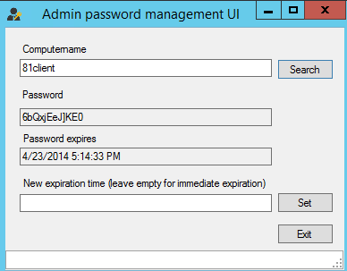

---
ref: 2211
title: Správa hesiel lokálnych administrátorov
date: 2015-03-28T14:18:20+00:00
layout: post
lang: sk
image: /assets/images/admpwd.png
permalink: /sk/sprava-hesiel-lokalnych-administratorov/
tags:
    - 'Active Directory'
    - PowerShell
    - Security
---

Chceli by&nbsp;ste mať na&nbsp;každom doménovom PC lokálny účet Administrator s&nbsp;unikátnym, náhodným a&nbsp;pravidelne meneným heslom, bez&nbsp;nutnosti to&nbsp;riešiť manuálne? Potom Vám môžem doporučiť veľmi zaujímavý open-source nástroj [Local admin password management solution](https://www.microsoft.com/en-us/download/details.aspx?id=46899 "Local admin password management solution"), ktorého autorom je&nbsp;Jiří Formáček.

