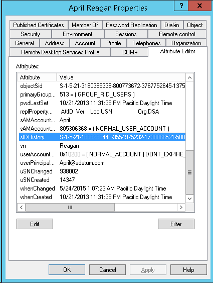

Jedným z možných útokov na&nbsp;bezpečnosť Active Directory je&nbsp;podvrhnutie [SID History](https://blog.thesysadmins.co.uk/admt-series-3-sid-history.html "SID History"). V Microsofte sú si toho plne vedomí a&nbsp;preto sú v&nbsp;Active Directory implementované 2 mechanizmy, ktoré zabraňujú efektívnemu zneužitiu SID History:

- Hodnoty atribútu sIDHistory prichádzajúce z&nbsp;externých trustov sú vo východzom stave ignorované vďaka funkcii [SID Filtering](https://technet.microsoft.com/en-us/library/cc772633%28v=ws.10%29.aspx "Configuring SID Filtering Settings").
- Atribút sIDHistory sa nedá len tak zmeniť na&nbsp;ľubovoľnú hodnotu ani&nbsp;pomocou konzoly Active Directory Users and&nbsp;Computers, ani cez&nbsp;PowerShell či&nbsp;nejaké API. Jediný podporovaný spôsob je&nbsp;použitie nástroja [ADMT](https://technet.microsoft.com/en-us/library/cc974332%28v=ws.10%29.aspx "Active Directory Migration Tool"), ktorý vie prekopírovať existujúci SID z dôverovanej domény do&nbsp;SID History v&nbsp;dôverujúcej doméne.

Ako však zapísať do&nbsp;SID History akúkoľvek hodnotu a&nbsp;obísť tak druhý z&nbsp;uvedených mechanizmov?

<!--more-->

## Existujúce riešenia

Možností je&nbsp;niekoľko a&nbsp;žiadna z&nbsp;nich nie je&nbsp;ideálna:

1. [Pridanie Samba 4 DC](https://cosmoskey.blogspot.cz/2010/08/online-sidhistory-edit-sid-injection.html)
    - Postup: 
        1. Pridať do domény linuxový Samba 4 doménový kontrolér.
        2. Manuálne upraviť SID History v jeho LDAP databáze.
        3. Prereplikovať z neho túto zmenu na Windows Server doménový kontrolér.
        4. Odobrať linuxový doménový kontrolér z domény.
    - Nevýhody: 
        - Nutnosť pridať nový DC, čo je nemalý zásah do domény a určite neostane bez povšimnutia.
        - Replikácia so Samba 4 nie vždy zafunguje úplne bezchybne, hlavne s najnovším Windows Server. To so sebou nesie riziko poškodenia doménových dát a preto toto riešenie nie je vhodné do produkcie.
2. Offline úprava Active Directory databázy 
    - Postup: 
        1. Zastaviť službu Active Directory Domain Services.
        2. Zapísať hodnotu sIDHistory priamo do databázy (tzn. súboru ntds.dit) pomocou nástroja [SHEdit](https://www.tbiro.com/projects/SHEdit/ "SHEdit") alebo [ESEAddSidHistory](https://gexeg.blogspot.cz/2009/12/active-directory.html "Безопасность в Active Directory ").
        3. Urobiť autoritatívne obnovenie dotknutých objektov.
        4. Znovu spustiť službu Active Directory Domain Services.
    - Nevýhody: 
        - Tieto nástroje vedia vyhľadávať používateľov podľa GUID, ale už nie podľa loginu či LDAP cesty.
        - Prvý z nich podporuje maximálne Windows Server 2003.
        - Nevedia do SID History zapísať viac hodnôt.
        - Neupravia replikačné metadáta.
        - Hodnotu SID History im treba zadať v binárnej podobe.
        - K zmenám nepoužívajú východzí tranzakčný log, ale vytvoria si nový log v tempe.
        - Občas poškodia databázu.
3. [Online hack](https://twitter.com/gentilkiwi/status/511244626456346624) pomocou nástroja [Mimikatz](https://github.com/gentilkiwi/mimikatz)
    - Postup: 
        1. Na bežiacom DC pustiť pod správcovským účtom **mimikatz**.
        2. Prideliť procesu právo na neobmedzený prístup do pamäte pomocou príkazu **privilege::debug**.
        3. Spustiť príkaz **misc::addsid** so správnymi parametrami.
    - Nevýhody: 
        - Neumožňuje zapísať do SID History ľubovoľnú hodnotu, ale len SID existujúceho účtu vo foreste.
        - Vyžaduje lokálnu operáciu na spustenom DC.
        - Jeho funkcionalita je postavená na binárnom opatchovaní pamäte procesu lsass tak, aby funkcia [DsAddSidHistory](https://msdn.microsoft.com/en-us/library/ms675918(v=vs.85).aspx) nevyžadovala prístupové údaje do domény, z ktorej sa kopíruje SID. To pravdepodobne prestane fungovať s najbližšou aktualizáciou, ktorá sa bude týkať Active Directory. Nehovoriac o tom, že takýto zásah zásah môže v lepšom prípade zhodiť DC, v tom horšom ho poškodiť.

## Moje riešenie

Keďže všetky dostupné riešenia majú zásadné nedostatky, rozhodol som sa&nbsp;naprogramovať vlastný nástroj, Add-ADDBSidHistory, ktorý tiež robí offline modifikáciu databázy a&nbsp;má tieto vlastnosti:

- Je&nbsp;spravený ako PowerShell 3+ príkaz a&nbsp;podporuje vstup cez&nbsp;pipeline.
- Umožňuje do&nbsp;SID History zapísať ľubovoľnú hodnotu. Nové hodnoty SID History sú pridané k&nbsp;existujúcim, ak nie sú duplicitné.
- Bezpečnostné objekty (používateľov, počítače a&nbsp;skupiny) vie vyhľadať na&nbsp;základe atribútov objectSid, objectGUID, sAMAccountName a&nbsp;distinguishedName. Pri vyhľadávaní na&nbsp;základe sAMAccountName odfiltruje zmazané a&nbsp;read-only objekty (kvôli GC). Ďalej využíva indexy, takže pracuje rýchlo aj&nbsp;nad databázou so&nbsp;150K+ objektami.
- Upraví replikačné metadáta (atribúty uSNChanged, whenChanged, replPropertyMetaData a&nbsp;globálny čítač HighestCommittedUsn). Toto východzie chovanie sa&nbsp;dá zmeniť pomocou prepínača `-SkipMetaUpdate`.
- Umožňuje zadať cestu k&nbsp;tranzakčným logom, pokiaľ nie sú uložené v&nbsp;databázovom adresári.
- Vie sa&nbsp;zotaviť z&nbsp;chybových stavov vďaka využitiu tranzakcií.
- Príkaz funguje na&nbsp;Windows Server 2012 R2 a&nbsp;2008 R2.

Príklad použitia:

```powershell
Import-Module .\DSInternals
Stop-Service ntds -Force
Add-ADDBSidHistory -SamAccountName April -SidHistory 'S-1-5-21-1868298443-3554975232-1738066521-500' -DBPath 'C:\Windows\NTDS\ntds.dit'
Start-Service ntds
```

Výsledok je&nbsp;potom nasledovný:



Príkaz je&nbsp;súčasťou PowerShell modulu DSInternals, ktorý nájdete v&nbsp;sekcii [Na stiahnutie](/sk/na-stiahnutie/ "Na stiahnutie"). Budem rád za&nbsp;akúkoľvek spätnú väzbu.

POZOR: Pred akýmkoľvek zásahom do&nbsp;AD databázy ju vždy najprv odzálohujte!

## Plánované funkcie

Mám rozpracované aj&nbsp;ďalšie príkazy na&nbsp;offline manipuláciu s&nbsp;Active Directory databázou. Budú mať tieto možnosti:

- Úprava používateľského atribútu primaryGroupId.
- Autoritatívny restore objektov na&nbsp;úrovni jednotlivých atribútov.
- Audit prítomnosti LM hashov, Kerberos DES/AES kľúčov a reverzibilne šifrovaných hesiel.
- Výpis vlastností databázy, napríklad názov DC, doména, site, Invocation ID, DSA Epoch, highest commited USN,...
- Výpis mapovania indexov na&nbsp;atribúty, napríklad INDEX_0015003 -&gt; mail. To&nbsp;sa potom bude dať plne zužitkovať príkaz [ntdsutil space usage](https://technet.microsoft.com/en-us/library/cc753900.aspx "ntdsutil files").
- Odstránenie niektorých závislostí, aby bolo možné príkazy spúšťať pod&nbsp;Windows PE 5.