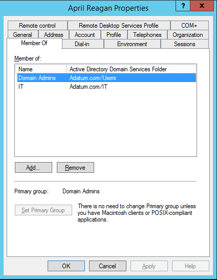

Spôsobov, ako sa&nbsp;dá **hacknúť doménový kontrolér**, ak útočník získa fyzický prístup k&nbsp;jeho systémovému disku, existuje veľa. Za&nbsp;zmienku stojí napríklad podvrhnutie [SID History](/sk/offline-zmena-sid-history/), o&nbsp;ktorom som nedávno písal, alebo [notoricky známe](https://www.sevecek.com/Lists/Posts/Post.aspx?ID=213) nahradenie nástroja **Klávesnica na&nbsp;obrazovke** príkazovým riadkom.
<!--more-->
Zo všetkých druhov útokov sa&nbsp;mi najviac páči **offline úprava Active Directory databázy**. Možnosť takéhoto zásahu do&nbsp;DC je&nbsp;známa už&nbsp;dávno, veď aj&nbsp;kvôli tomu vznikla funkcia [Read-Only Domain Controller](https://learn.microsoft.com/en-us/previous-versions/windows/it-pro/windows-server-2008-R2-and-2008/cc732801(v=ws.10)). Na&nbsp;druhú stranu, keďže je&nbsp;štruktúra Active Directory databázy veľmi komplikovaná a&nbsp;takmer nulovo zdokumentovaná, neexistujú skoro žiadne verejne dostupné nástroje pomocou ktorých by&nbsp;sa&nbsp;dal takýto útok realizovať. Tie, ktoré [poznám](/sk/offline-zmena-sid-history/), sa&nbsp;výhradne sústredia na&nbsp;už&nbsp;spomínanú úpravu SID History. Preto som sa&nbsp;rozhodol vytvoriť powershellovský príkaz **Set-ADDBPrimaryGroup**, ktorý slúži na&nbsp;offline zmenu členstva v&nbsp;skupinách.

> VAROVANIE: Funkcionalita modulu DSInternals nie je&nbsp;podporovaná firmou Microsoft a&nbsp;preto nie je&nbsp;určený pre&nbsp;produkčné nasadenie. Jeho nesprávne použitie môže spôsobiť nevratné poškodenie doménového kontroléru alebo negatívne ovplyvniť bezpečosť domény.

## Realizácia útoku

Predpokladajme, že&nbsp;v&nbsp;AD už&nbsp;máme neprivilegovaný účet, napríklad April, ktorý je&nbsp;členom skupiny **Domain Users** a&nbsp;my by&nbsp;sme ho&nbsp;radi zaradili do&nbsp;skupiny **Domain Admins**. To&nbsp;môžeme spraviť dvomi cestami, buď modifikáciou atribútu **member** na&nbsp;skupine alebo atribútu **primaryGroupId** na&nbsp;používateľskom účte. Ja som si&nbsp;zvolil tú druhú možnosť, pretože je&nbsp;jednoduchšia.

Potrebujeme ešte poznať [RID](https://learn.microsoft.com/en-us/windows/win32/secauthz/sid-components) cieľovej skupiny. Z&nbsp;[dokumentácie](https://learn.microsoft.com/en-US/windows-server/identity/ad-ds/manage/understand-security-identifiers#well-known-sids) ľahko dohľadáme, že&nbsp;skupina Domain Admins má RID **512**, Domain Users **513** a&nbsp;Domain Controllers **516**. Použiť by&nbsp;sme samozrejme mohli RID ľubovoľnej globálnej a&nbsp;univerzálnej skupiny, ktorá je&nbsp;v&nbsp;doméne účtu April.

Na&nbsp;zapnutom DC&nbsp;nám potom stačí spustiť túto&nbsp;sekvenciu príkazov:

```powershell
Import-Module .\DSInternals
Stop-Service ntds -Force
$db = 'C:\Windows\NTDS\ntds.dit'
Set-ADDBPrimaryGroup -DBPath $db -SamAccountName 'April' -PrimaryGroupId 512 -Verbose
Start-Service ntds
```

Výsledok môžeme overiť pohľadom do&nbsp;konzole Active Directory Users and&nbsp;Computers:



Pri offline prístupe na&nbsp;disk (boot z&nbsp;flashky či&nbsp;pripojenie HDD/VHD do&nbsp;iného PC) samozrejme nie sú&nbsp;nutné príkazy na&nbsp;zastavenie a&nbsp;spustenie služby Active Directory Domain Services (ntds).

Po nábehu&nbsp;služby ntds sa&nbsp;zmena členstva v&nbsp;skupinách automaticky zreplikuje na&nbsp;ostatné doménové kontroléry. Pokiaľ to&nbsp;nie je&nbsp;žiadúce chovanie, stačí spustiť príkaz Set-ADDBPrimaryGroup s&nbsp;prepínačom **-SkipMetaUpdate** a&nbsp;zmena ostane len&nbsp;na&nbsp;napadnutom DC. Zníži sa&nbsp;tým šanca na&nbsp;odhalenie útoku.

## Poznámky

- Príkaz Set-ADDBPrimaryGroup vie vyhľadať účty používateľov a&nbsp;počítačov na&nbsp;základe **login**u, **SID**u, **GUID**u a&nbsp;LDAP **distinguished name** (DN).
- Existencia RIDu skupiny zatiaľ nie je&nbsp;kontrolovaná. Je&nbsp;tak možné zadať akékoľvek číslo **od&nbsp;1 do&nbsp;2<sup>30</sup>**. Nepodporuje tak novú funkciu Windows Server 2012, ktorá umožňuje [odomknúť 31. bit](https://learn.microsoft.com/en-us/windows-server/identity/ad-ds/manage/managing-rid-issuance), ale&nbsp;to&nbsp;snáď nikto nebude potrebovať.
- Príkaz k&nbsp;svojmu behu vyžaduje aspoň **PowerShell 3**.
- Úprava súboru ntds.dit je&nbsp;možná len&nbsp;**z tej istej verzie Windows** (napríklad 6.1), z&nbsp;ktorej pochádza tento súbor. Je&nbsp;to&nbsp;spôsobené tým, že&nbsp;každá nová verzia Windows mierne upravuje formát ESE databázy. Riešením by&nbsp;bolo distribuovať s&nbsp;mojiím PowerShell modulom aj&nbsp;rôzne verzie systémovej knižnice **esent.dll**, ale&nbsp;to&nbsp;by&nbsp;bolo hrubé porušenie licenčnýh podmienok.
- Použitie tohto nástroja je&nbsp;možné výhradne na&nbsp;**výskumné a&nbsp;testovacie účely**. Neručím za&nbsp;žiadne škody, ktoré by&nbsp;mohli vzniknúť jeho využitím.

## Získanie programu

Príkaz Set-ADDBPrimaryGroup je&nbsp;súčasťou poslednej verzie môjho PowerShell modulu DSInternals, ktorý si&nbsp;môžete [bezplatne stiahnuť](/sk/projekty/).
