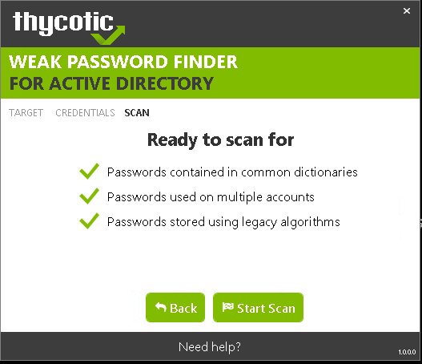
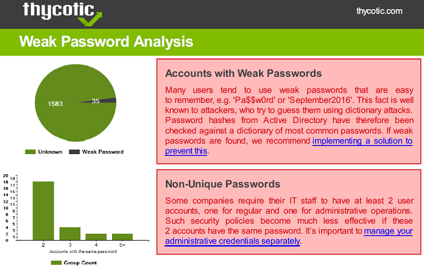
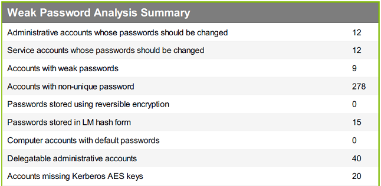
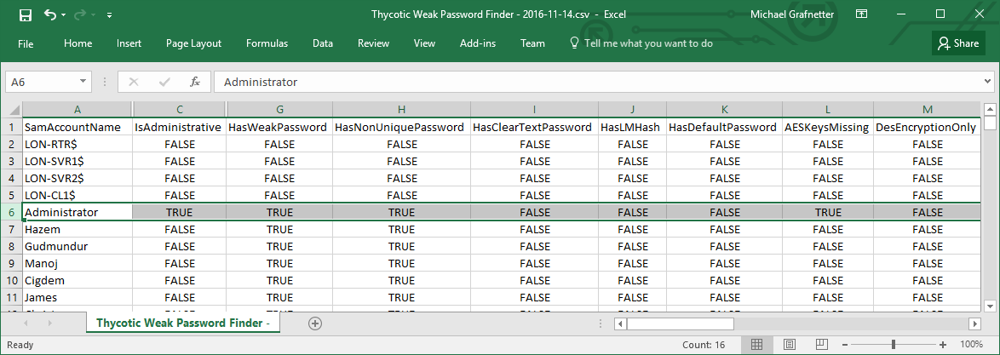

Nedávno som spolupracoval so&nbsp;spoločnosťou [Thycotic](https://thycotic.com/) na&nbsp;vývoji programu [Weak Password Finder for&nbsp;Active Directory](https://thycotic.com/solutions/free-it-tools/weak-password-finder/weak-password-finder-nvlss/). Cieľom bolo vytvoriť nástroj, ktorý by&nbsp;bol síce jednoduchý na&nbsp;používanie, ale&nbsp;pritom by&nbsp;dával viac než uspokojivé výsledky. To&nbsp;sa&nbsp;myslím podarilo a&nbsp;táto kombinácia ho&nbsp;robí unikátnym na&nbsp;trhu.

<!--more-->

Výsledkom skenovania AD sú&nbsp;prehľadné manažérske reporty:

Správcovia siete potom môžu analyzovať podrobné výsledky:

Tu je&nbsp;krátke video demonštrujúce funkcionalitu programu:

<iframe allowfullscreen="allowfullscreen" frameborder="0" height="281" mozallowfullscreen="mozallowfullscreen" src="https://player.vimeo.com/video/197521549" title="Weak Password Finder Demo" webkitallowfullscreen="webkitallowfullscreen" width="500"></iframe>

A&nbsp;čo je&nbsp;najlepšie, [Weak Password Finder](https://thycotic.com/solutions/free-it-tools/weak-password-finder/weak-password-finder-nvlss/) je&nbsp;dostupný úplne zadarmo.
