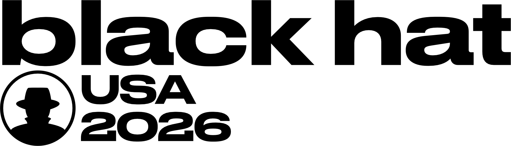

Na&nbsp;konferencii **Black Hat USA&nbsp;26** v&nbsp;Las Vegas som mal prednášku s&nbsp;názvom [Pass-the-Passkey Family of&nbsp;Attacks](https://blackhat.com/us-26/briefings/schedule/?#pass-the-passkey-family-of-attacks-51821).

Materiály k prednáške sú dostupné tu:

- [<i class="fas fa-file-pdf"></i>  Slajdy](../../assets/documents/bhus26-grafnetter-pass-the-passkey-slides.pdf)
- [<i class="fas fa-file-pdf"></i>  Článok](../../assets/documents/pass-the-passkey-a4-v2.pdf)
- [<i class="fab fa-github"></i>  Nástroje Pass-the-Passkey](https://github.com/SpecterOps/pass-the-passkey)
- [<i class="fab fa-github"></i>  Nástroje WebAuthn Interop / Passkey UI / DSInternals.Passkeys](https://github.com/MichaelGrafnetter/webauthn-interop)
